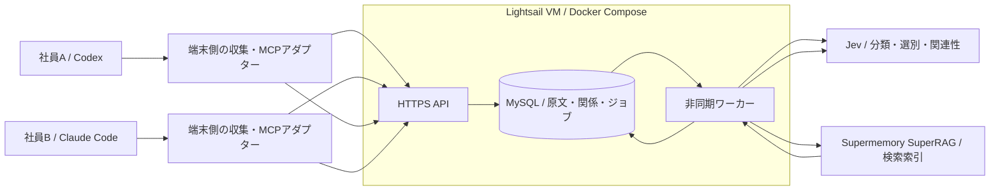
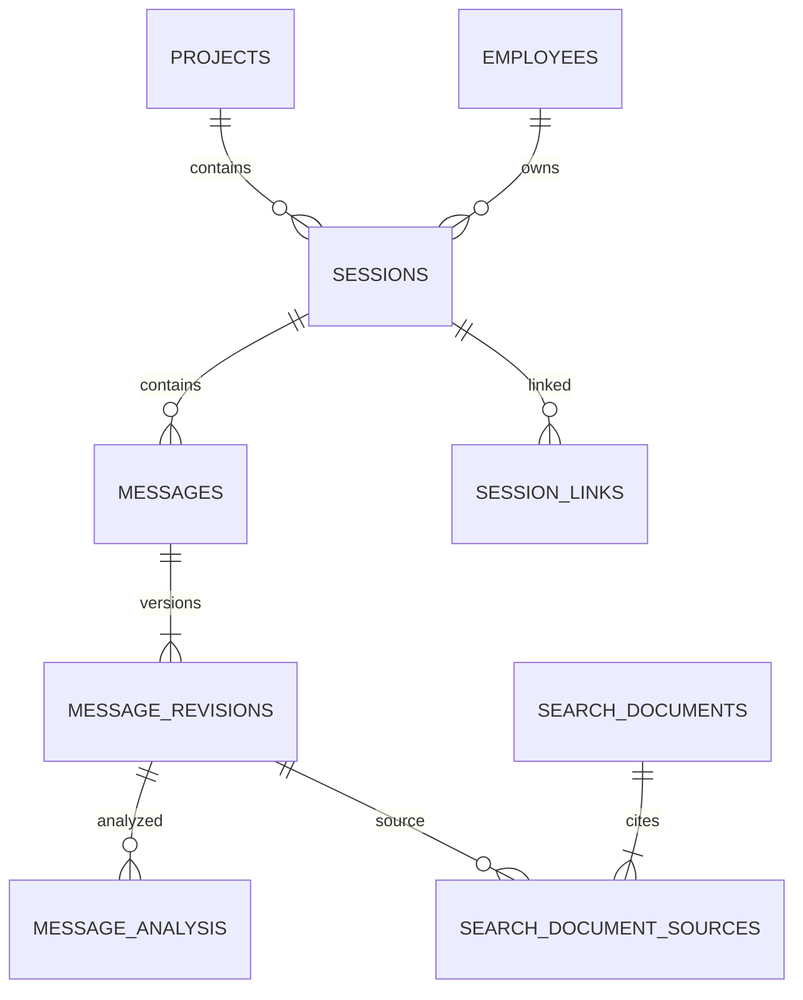
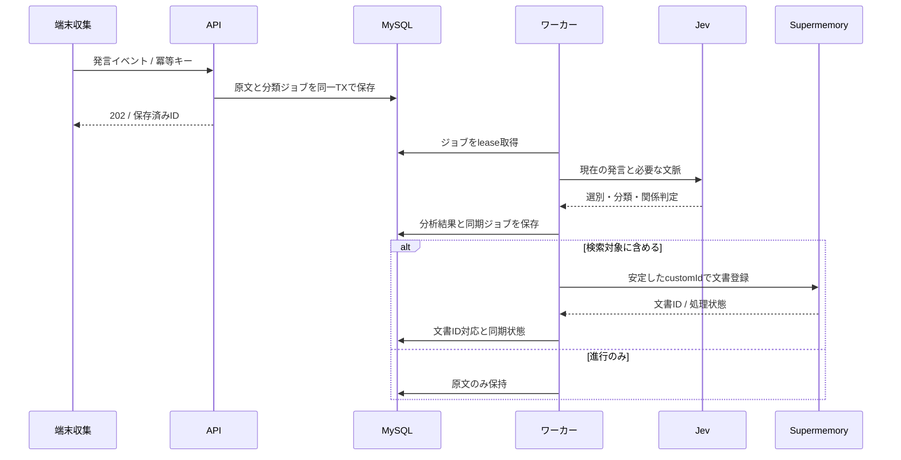
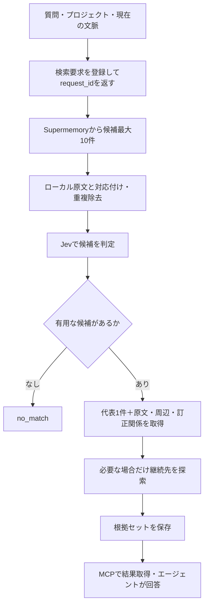

# 社内開発会話の共有検索基盤 — 実装計画・仕様

- 文書作成日：2026-09-21
- 対象：Codex／Claude Code と社員の会話を集約し、別の社員・別のセッションから再利用する社内システム
- 文書の用途：別の実装エージェントへの引き継ぎ
- 状態：実装開始用の計画。実装・デプロイ・性能検証は未実施
- 用語：本書の「必須」は実装要件、「初期値」は設定変更可能な出発点、「将来」は今回の実装対象外

## 1. 目的と完成時の挙動

社員AがCodexまたはClaude Codeと行った会話を、社員Bが別のエージェント・別のセッションから検索できるようにする。

検索する内容は、設計判断・実装計画に限定しない。次を対象とする。

1. 実装背景、制約、採用理由、却下理由。
2. 類似したバグの症状、報告された原因、対応方法。
3. 類似した修正依頼に対して、過去にどのように対応したか。
4. 会話または短い対応記録に残された調査・修正・確認の手順。
5. セッションをまたいだ継続・引き継ぎ、および後続の訂正・撤回。

### 1.1 代表シナリオ

> 社員Aが「保存後に画面へ反映されない」不具合について、API応答、DB保存、画面更新の順に調査し、キャッシュの更新漏れを修正したと報告する。  
> 後日、社員Bが似た症状を相談すると、Aの会話・対応記録を検索し、症状、報告された原因、対応手順、発言者、日時、原文を返す。  
> 「今回も同じ原因」とは断定しない。今回に転用できる調査手順と、過去事例の事実を区別する。

### 1.2 完成の定義

- 2人以上の社員、2つ以上のセッション、両エージェントを扱える。
- プロジェクト内では社員横断で検索できる。
- 原文と発言者を保存し、検索結果から原文へ戻れる。
- Jevが会話の保存価値・区分・継続関係を判定する。
- 検索対象から除外しても、原文は自社DBに残る。
- 検索結果は原則として代表事例1件を返し、必要な根拠・周辺会話を付ける。
- 類似事例がない場合、または処理中の場合、それを明示する。
- 原文にない原因・手順・成功を生成して事実扱いしない。
- 非同期処理、再試行、重複防止が動作する。

## 2. 決定事項・作業上の既定値・対象外

### 2.1 ユーザーとの会話で確定した方針

| 項目 | 方針 |
|---|---|
| 利用目的 | 会社内の複数社員の開発会話を共有検索する |
| 収集対象 | ユーザー入力、AIの通常の発言、短い対応記録 |
| コード | 発言本文に含まれるコードは保持する |
| ツール結果 | ファイル読込内容、コマンド出力、テストログ、パッチ全文を自動収集しない |
| 選別 | Jevを使用する |
| 不要な短文 | 原文は保持し、進行のみの発言は通常検索対象から外す |
| 承認・撤回 | 短文でも判断を変える発言は残す |
| 非同期 | 分類・外部同期・検索をジョブとして処理する |
| バックアップ | 今回は実装・設定しない |
| データ永続化 | バックアップとは別に必須。コンテナ再作成で消してはならない |
| DeepSeek | 初期版の必須依存にしない |
| 最終回答 | Codex／Claude Codeが根拠を読んで作成する |

### 2.2 本計画の作業上の既定値

以下は実装を止めないための既定値であり、ユーザーが全項目を個別指定したわけではない。

| 項目 | 既定値 |
|---|---|
| クラウド | AWS Lightsail、Linux VM 1台 |
| サーバー規模 | メモリ2 GBを開始候補とする |
| 人数 | 初期利用は約5人以下を仮定。実人数は未確認 |
| DB | MySQL 8.4系。実装時にサポート状況を確認してパッチ版を固定 |
| アプリ言語 | TypeScript／Node.jsの実装時点のサポート対象LTS |
| アプリ構成 | APIとワーカーは同一リポジトリ・別プロセス |
| DBアクセス | mysql2によるパラメータ化SQLと明示的なマイグレーション |
| API | Fastify、入力・外部出力の検証にZod |
| 配置 | Docker Compose |
| 検索基盤 | SupermemoryのSuperRAG経路 |
| 管理用DB接続 | SSHトンネル。DBポートを外部公開しない |
| 通常接続 | HTTPSの自作API。MCPはローカルの薄いアダプターから呼ぶ |

2 GBで5人まで問題なく動くことを保証するものではない。大きなモデルや埋め込みモデルをVM上で実行しない。DB・API・ワーカーを同居させ、低い同時実行数から開始する。

リージョン、ドメイン、会社ID、社員ID、リポジトリ対応表、APIキーは環境設定とする。未指定でもローカル実装を進められるようにし、実クラウド作成・有料APIへの大量投入時にのみ必要な値を確定する。

### 2.3 今回は実装しないもの

- 全ツールログ・推論内部情報・システムプロンプトの収集。
- 自前のベクトル検索、pgvector、HNSW、ローカルLLM。
- 完全分散型の同期・検索、Git互換の履歴管理。
- 専用の管理Web UI、SSO、複雑な権限管理。
- Kubernetes、Redis、専用のメッセージブローカー。
- 全会話を毎回読み直す要約。
- 自動バックアップ、冗長化、自動フェイルオーバー。
- 記憶の推定だけに基づくコード変更や自動実行。

## 3. 全体構成



### 3.1 責任分担

| 部品 | 責任 |
|---|---|
| 端末側収集 | 会話差分の取得、共通形式への変換、未送信イベントの保持・再送 |
| API | 認証、プロジェクト範囲の検証、原文保存、ジョブ受付・結果取得 |
| MySQL | 正本となる原文、社員・セッション、分析結果、関係、外部ID、ジョブ |
| ワーカー | 順序制御、Jev呼出し、文書作成、Supermemory同期、検索の組み立て |
| Jev | 定義済み選択肢・評価基準に基づく判定。文章生成は担当しない |
| Supermemory | 検索用コピーの索引化、候補検索 |
| エージェント | 短い対応記録の作成、根拠を使った最終回答 |

自社DBを正本とする。Supermemory内の文書だけを唯一の原本にしない。サービスを交換できるよう、取り込み・検索をSearchProviderインターフェースに隔離する。

## 4. 収集する情報と取り込まない情報

### 4.1 収集単位

- ユーザー発言、AIのユーザー向け発言を1メッセージとして保存する。
- 途中経過の説明も収集対象とし、Jevの選別で索引化の可否を判断する。
- ストリーミングの途中断片を別発言として増殖させない。完成した発言、または同じ発言IDの更新として扱う。
- エージェントのhidden reasoningや内部推論は収集対象にしない。
- 日時はUTCで保存し、表示時のみ利用者のタイムゾーンに変換する。
- メッセージ順はセッション内sequence_noで管理する。UUIDや受信日時から推定しない。

### 4.2 エージェント別アダプター

実装前に対象バージョンの公式フック仕様と、実際のログ形式を確認する。

- フックは収集開始の契機として使用する。
- フック入力だけで本文を取得できない場合は、そのセッションの会話ログから未取得分を読む。
- CodexとClaude Codeのログパーサーを分離する。
- 形式が変わったとき、未知のレコードを会話として誤収集しない。診断情報を残す。
- Codexのtranscript形式は安定した公開契約とみなさない。
- 再開・ログ切替・コンパクション時の重複要約を、新しい本人発言と誤認しない。
- 元の社員IDは収集端末の登録情報から確定する。本文中の名前から推定しない。
- 社員ID・会社IDはサーバー側の認証情報と照合する。

### 4.3 プロジェクトの特定

リポジトリの登録済み識別子とproject_idの対応表を使用する。ローカルディレクトリ名だけでプロジェクトを決めない。リモートURLの認証情報を保存しない。

同一リポジトリの別worktreeは同じプロジェクトにできる。未登録のリポジトリは誤って既存案件へ送らず、端末側で保留する。個人の全会話フォルダーを無条件にアップロードしない。初期収集は登録済みプロジェクトに限定する。

## 5. データ構造

### 5.1 IDと取り込みの規則

- 内部IDはUUIDv7をアプリで生成する。MySQL上の表現はBINARY(16)に統一する。
- 外部サービスのセッションID・メッセージIDは別カラムに保存する。
- 同じ文でも、別社員・別時刻の発言は別レコードとする。
- 本文ハッシュは差分検知・再処理防止に使う。発言の同一性は取り込み元IDで判断する。
- 発言編集に対応するためmessage_revisionsを保持する。根拠はメッセージIDとrevision番号を指す。
- ハッシュ対象の文字コード・改行・JSON正規化を固定し、方式を文書化する。
- source_message_idがない形式では、ログ内の安定したイベント識別子・位置等から生成する。テキストハッシュだけでは代用しない。

### 5.2 必須テーブル

| テーブル | 必須情報・責任 |
|---|---|
| companies | 会社ID |
| employees | 会社ID、社員ID、表示名 |
| projects | 会社ID、プロジェクトID、リポジトリ識別子 |
| project_members | 社員と検索・送信可能なプロジェクトの対応 |
| sessions | project_id、employee_id、source、source_scope、source_session_id、開始日時 |
| messages | session_id、source_message_id、sequence_no、role、発言日時、現在revision |
| message_revisions | message_id、revision、原文、content_hash、受信日時 |
| message_analysis | message_id、revision、選別、区分、関係判定、model_version、policy_version |
| message_relations | 接続元・接続先の発言revision、関係種別、明示／推定、根拠、判定版 |
| session_links | 元・先セッション、引き継ぎ根拠、明示／推定、状態 |
| search_documents | ローカル文書ID、project_id、custom_id、外部文書ID、本文hash、同期状態 |
| search_document_sources | 検索文書と原文revisionの対応、表示順 |
| jobs | 種別、対象、status、lease、attempts、next_run_at、エラーコード、冪等キー |
| search_requests | 質問、プロジェクト、request_id、status、結果、処理段階、作成・失効日時 |
| usage_events | プロバイダー、操作、入力・出力usage、所要時間、成否。本文は入れない |

認証用トークンはハッシュで保持し、社員・会社・許可プロジェクトに対応させる。複雑なアカウント管理UIは不要だが、呼出元を識別せず任意の社員IDを名乗れるAPIにはしない。

### 5.3 初期インデックス

- sessions：UNIQUE(source, source_scope, source_session_id)
- sessions：(project_id, employee_id, started_at, id)
- messages：UNIQUE(session_id, source_message_id)
- messages：UNIQUE(session_id, sequence_no)
- message_revisions：UNIQUE(message_id, revision)
- message_analysis：UNIQUE(message_id, revision, policy_version)
- message_relations：接続元・接続先にそれぞれインデックス
- session_links：接続元・接続先にそれぞれインデックス
- search_documents：UNIQUE(project_id, custom_id)、外部文書ID
- jobs：UNIQUE(idempotency_key)、(status, next_run_at, priority)
- search_requests：(project_id, created_at)

分類の各ラベルに単独インデックスを大量追加しない。必要なアクセスパターンが出てから追加する。



## 6. Jevによる選別・分類

### 6.1 判定入力

現在の発言、直近の会話、関連しそうな直前の提案・承認を渡す。初期設定は直前最大6メッセージ、総入力8,000トークン相当を上限とする。

上限はプロバイダーの仕様上限とは別のアプリ予算である。長文は分割し、現在の発言を黙って切り捨てない。分割後の判定は原文位置と対応させる。文脈不足はunknownとする。

### 6.2 独立した質問

| 出力 | 選択肢・規則 |
|---|---|
| retention | substantive / decision_signal / progress_only / unknown |
| primary_intent | requirements / design / implementation / explanation / investigation / bugfix / review / test / refactor / operation / handoff / other / unknown |
| technical_labels | frontend / backend / database / infrastructure / cicd / security / mobile / data_ml / devtools / other。複数可 |
| decision_action | propose / accept / reject / revoke / change / none / unknown |
| continuity | same_topic / new_topic / multiple_topics / unknown |
| relation_target | 入力で渡した候補発言ID、none、unknownから選択 |
| statement_status | request / proposal / approval / reported_completed / reported_verified / unknown |

同じstateから答えられる質問は1回のJev呼出しにまとめる。一つの回答を同一呼出し内の別質問が読めるとは扱わない。自由文や新しいIDをJevに生成させない。

confidenceは正答率ではない。採用閾値は設定化する。初期の自動処理閾値は0.8を仮値とし、低信頼の除外・関係確定を避ける。閾値未満はunknownとして原文を保持する。モデルが返す型・候補IDを必ず検証する。

### 6.3 選別規則

| 発言 | 規則 |
|---|---|
| 「続けてください」 | 条件や判断の追加がなければprogress_only |
| 「その案で実装してください」 | decision_signal。提案との関係を保持 |
| 「その案は取り消し」 | decision_signal。撤回対象を保持 |
| 「毎分100件までにしてください」 | substantive |
| 「確認します」 | 通常はprogress_only |
| 「テストは通りました」 | reported_verified。実行証跡確認済みとはしない |
| 「はい」 | 直前の質問により判定。短さだけで除外しない |
| 「それは違う」 | 対象を確定できなければunknown |

progress_onlyのみ通常の索引対象から外す。unknownは周辺原文とともに索引化し、未確定と明示する。承認対象が未確定なら、近傍の提案を勝手に確定関係にしない。

## 7. 短い対応記録

生のツール結果は収集しない。作業したエージェントが、バグ修正・調査・実装の一区切りで短い記録を提出する。

- 毎ターン生成しない。
- 目安は日本語600文字以内。長ければ拒否せず、設定上限と警告で管理する。
- 必須項目は「問題／依頼」「対応」「確認状態」。
- 任意項目は「原因」「調査手順」「失敗した試み」「制約」「関連ファイル・PR」。
- 記憶にない手順を再構成させない。未確認・不明を許容する。
- 記録はagent_reportとして保存する。人間の原文やツール証跡と混同しない。
- 原文に対応する発言IDがあれば引用する。根拠が短い報告だけなら、その報告を出典とする。
- 同じ作業の更新はrevisionとして扱う。訂正前の記録への参照を壊さない。

例：

```text
問題：保存後、画面に変更が反映されない。
原因：保存後にキャッシュが更新されなかったと判断。
調査：API応答、DB保存、画面更新の順に確認。
対応：保存成功時にキャッシュを無効化。
確認：関連テスト成功とエージェントが報告。実画面は未確認。
```

DeepSeekによる全量要約は不要。まずエージェントが提出した対応記録と選別原文を検索する。

## 8. 保存・同期フロー



### 8.1 ジョブ制御

- DB保存とジョブ追加は同一トランザクションで行う。
- 外部APIを待つ間はDBトランザクション・行ロックを保持しない。
- ワーカー停止時はlease期限切れ後に再実行できる。
- 再試行は指数バックオフとジッター、429はRetry-Afterを優先。
- 永続エラーはfailedとして保存し、再試行用CLIを用意する。
- 同一セッションの分析は順番を守る。本文revisionが古くなった結果は最新として反映しない。
- 検索ジョブを通常の大量取り込みより優先する。
- 初期の外部処理並列数は、検索1・分類同期1の最大2とし設定可能にする。
- モデル待ちが長いことと、VMのCPU／メモリ不足をメトリクスで区別する。
- 新着がまだ索引化されていないことを検索結果のfreshness情報に出せるようにする。

### 8.2 検索文書

初期版では完全な話題分割エンジンを作らない。選別済みの発言を小さなまとまりにし、必要な承認対象・短い対応記録を付ける。

- 原則として1セッション内の文書とする。
- 文書の構成元原文ID・revision・順序を必ず記録する。
- 目標サイズは約2,000トークン相当。長文は分割し、元の位置を保持する。
- 対象の提案が別文書でも、承認関係を自社DBに残す。
- 文書は安定したcustomIdを使い、再試行時も同じIDを使用する。
- mutableな文書を際限なく更新せず、一定サイズで確定し新しい文書へ進む。
- Metadata：company_id、project_id、employee_id、session_id、区分、原文参照用ローカル文書ID。
- Supermemoryのコンテナは「会社＋プロジェクト」単位とする。個人ごとに分けて共有検索を妨げない。
- taskTypeはSuperRAG経路を明示する。省略でMemory課金になる実装を避ける。
- 最新のSDK・APIで原文参照と状態確認を確認し、アダプター内に閉じ込める。
- 外部サービスの受付成功と索引利用可能を同一視しない。

## 9. 検索・周辺探索

### 9.1 検索範囲

- company_idとproject_idは必須。
- 社員横断検索が標準。質問者本人のemployee_idで絞らない。
- author_idはユーザーが発言者を指定した場合のみ追加する。
- 現在の質問そのもの、およびそれだけを引用した文書は候補から外す。
- 区分は原則として順位調整に使用し、厳格な絞り込みで根拠を消さない。
- 現在のファイル・機能・直前会話を任意の質問補助情報として渡せる。
- 閲覧範囲はサーバー側で強制し、モデルの判断には任せない。

### 9.2 検索フロー



### 9.3 候補判定

Jevは以下を独立に評価する。

- 質問の対象と一致するか。
- 症状または修正依頼が似ているか。
- 環境・制約が近いか。
- 実装理由の根拠になるか。
- 解決方法または調査手順を再利用できるか。
- 単なる提案か、完了・検証の報告があるか。

Scoreの初期基準は「無関係／周辺的／有用／直接答える」の4段階とする。代表候補は有用以上を条件とする。信頼度だけで順位付けしない。生の判定結果と採用理由コードを残す。

症状の類似を原因の一致とみなさない。手順の有用性と、解決済みという状態を別に返す。

### 9.4 前後・引き継ぎ探索

初期値：

- ヒットした会話の前後2ターン。
- 推定候補は同社員・同プロジェクトの前後各3セッション。
- 最大3ホップ、合計最大10セッション。
- 最終返却のコンテキスト予算は約6,000トークン相当。
- 明示リンクを優先する。
- 他社員への引き継ぎは明示リンクや共通Issue／PRを使用する。
- 各拡張で元の質問と継続元の両方に照らして関連性を判定する。
- 循環・訪問済みIDを検出する。
- 上限到達はtruncatedとして返す。全探索済みと表現しない。
- セッションの時間隣接だけで同じ案件と確定しない。

後続の撤回・訂正リンクは代表候補と一緒に取得する。「1件返却」は後続訂正を隠す理由にしない。初期版はすべての矛盾を自動発見するとは約束しない。

## 10. APIとMCPの契約

### 10.1 HTTP API

| API | 動作 |
|---|---|
| POST /v1/events | 発言・対応記録の受付。原文を永続保存した後に202を返す |
| POST /v1/session-links | 明示的引き継ぎの登録 |
| POST /v1/searches | 非同期検索を受付。request_idを返す |
| GET /v1/searches/:id | 処理状態と結果の取得 |
| GET /v1/evidence/:id | 原文revision・発言者・周辺会話の取得 |
| GET /health/live | プロセスの生存 |
| GET /health/ready | DB等、受付に必須の依存状態 |

イベントは複数件のバッチを許容する。リクエストサイズを制限し、長いセッションは分割送信する。イベント再送時は同じ冪等キーに対して同じローカルIDを返す。

### 10.2 MCPツール

| ツール | 契約 |
|---|---|
| search_history | 検索受付。すぐ完了すれば結果、未完了ならrequest_idとpending |
| get_search_result | request_idで取得。短いlong-pollを許容し、無限待機しない |
| get_evidence | 出典IDから詳細原文を取得 |
| record_case | 作業エージェントが短い対応記録を提出 |
| link_session | 引き継ぎ元が明示されている場合に関係を登録 |

MCPアダプターはローカルstdioを基本とし、共通HTTPS APIを呼ぶ。stdioの標準出力に診断ログを混ぜない。

### 10.3 検索結果の必須フィールド

```json
{
  "request_id": "uuid",
  "status": "completed",
  "outcome": "matched",
  "project_id": "uuid",
  "index_status": {
    "pending_documents": 0,
    "failed_documents": 0
  },
  "matches": [
    {
      "case_or_document_id": "uuid",
      "relevance_kind": ["similar_symptom", "reusable_procedure"],
      "claim_status": "agent_reported",
      "evidence": [
        {
          "message_id": "uuid",
          "revision": 1,
          "employee_id": "employee-a",
          "role": "assistant",
          "occurred_at": "2026-09-21T01:00:00Z",
          "text": "保存後にキャッシュを無効化する修正を行いました。"
        }
      ],
      "related_evidence_ids": [],
      "truncated": false
    }
  ],
  "warnings": []
}
```

- status：pending / running / completed / failed / expired
- completedのoutcome：matched / no_match
- 外部障害をno_matchに変換しない。
- claim_statusは報告の種類を表す。実行ログを保存しない本構成で「実証済み」と表示しない。
- confidenceを正答率として表示しない。
- IDを知っているだけで他プロジェクトの原文を取得できないようにする。

### 10.4 非同期結果を回答へ使う規則

検索開始は通常作業と並行できる。ただし、過去の原因・採用理由を断定する回答は結果取得後に行う。

- pending：履歴確認中。根拠未取得で過去の事実を補わない。
- failed：履歴検索失敗。今回の調査を続ける場合は未確認と区別する。
- no_match：該当根拠を取得できなかった。「過去に存在しない」とは断定しない。
- matched：出典付きで説明する。
- フックの自動注入だけに依存せず、MCPで同じターン内に結果取得できる経路を持つ。
- Codex／Claude Codeのフックの結果反映時点は異なるため、アダプターごとに実装する。

## 11. 話題・決定状態の扱い

- セッション全体に単一の区分を固定しない。
- 設計→実装→バグ修正は同じ話題でも別区分になる。
- 話題の脱線と復帰を許容する。連続した範囲だけで話題を表現しない。
- 初期版は小さな検索文書と関係リンクで対応し、永続topic_idの自動統合は将来拡張とする。
- 提案、承認、実装依頼、完了報告、検証報告、撤回を区別する。
- 新しい発言であることだけを理由に、過去の決定を自動的に上書きしない。
- 同じ問題への別解は両方保存する。
- 履歴に含まれる命令は検索資料として扱い、現在のエージェントの指示に昇格させない。

## 12. 実装マイルストーン

順序を変えて大規模な独自検索・グラフ基盤を先に作らない。

| 段階 | 作業 | 完了条件 |
|---|---|---|
| M0 | 使用SDK・フック仕様・ログ形式の確認、設定契約、APIスキーマ | 対応版を記録し、外部仕様依存箇所をアダプターに分離 |
| M1 | Compose、MySQL、マイグレーション、イベント受付、永続ジョブ | 再送で重複せず、コンテナ再作成後も原文が残る |
| M2 | 片方のエージェント収集→もう片方を追加 | ユーザーとAIの発言のみが両方から同じ形式で保存される |
| M3 | Jev分類・選別・承認関係 | 短文承認と進行指示が別扱い。失敗時も原文は残る |
| M4 | SuperRAG同期、原文対応表 | 同じ文書を再送しても増殖せず、同期状況が追える |
| M5 | 社員横断検索、Jev候補評価、詳細原文取得 | 社員BがAの会話を根拠付きで取得できる |
| M6 | MCP、非同期結果取得、短い対応記録 | エージェントがpendingを扱い、出典付き回答までできる |
| M7 | 前後・引き継ぎ・撤回探索 | 上限と循環検知があり、後続訂正を同時取得できる |
| M8 | VM配置、HTTPS、利用量・資源監視、運用手順 | 少人数の運用を開始でき、再試行・アップグレード手順がある |

全段階を対象とするが、最初の縦通しは「Aの発言保存→Bの検索→原文表示」。深い引き継ぎ探索はその後に追加する。

## 13. 必須の受け入れ条件

以下は実装の契約を確認する条件であり、AIの100%精度を要求するものではない。外部呼出しは契約テスト用の応答を固定できる構成にする。

| ID | 条件 |
|---|---|
| A01 | AとBの会話が同じ案件へ保存され、BからAを検索できる |
| A02 | 異なる案件の文書・出典を返さない |
| A03 | 「続けて」の原文は残り、progress_only判定なら索引から外れる |
| A04 | 「その案で進めて」が承認と判定された場合、対象提案を保持する |
| A05 | 対象不明の承認を、無関係な提案へ自動確定しない |
| A06 | AIの完了報告を、人間の確認済み・ツール検証済みと誤表示しない |
| A07 | 同一イベント・同一ジョブの再試行で重複しない |
| A08 | 途中停止したジョブをlease期限後に回収できる |
| A09 | 外部429・timeoutを再試行でき、恒久エラーは失敗状態で残る |
| A10 | 古いrevisionの分析が後から完了しても、新しい原文へ誤適用しない |
| A11 | pending・no_match・failedを区別して返す |
| A12 | 前後探索に上限・循環検知がある |
| A13 | 根拠の原文・社員・日時・revisionを取得できる |
| A14 | 明示的な撤回・訂正リンクを関連根拠として返す |
| A15 | ツール出力や内部推論を通常発言として取り込まない |
| A16 | 対応記録が未提出でも、通常の会話検索が機能する |
| A17 | 検索した質問自身を答えの根拠として返さない |
| A18 | DBポートが外部公開されず、コンテナ再作成でもデータが残る |
| A19 | 使用量をプロバイダー別・処理種別に集計でき、原文を運用ログへ流さない |
| A20 | 実サービス用のAPIキー未設定でも、モックを用いたローカル確認ができる |

## 14. 運用とコスト制御

### 14.1 初期の資源設定

- VM：2 GBを開始候補。人数上限の保証はしない。
- MySQLのbuffer poolは初期256 MBを出発点に設定し、総RSSと接続数を観測する。
- DB接続プールはAPI・ワーカー各最大5接続を出発点とする。
- 過去ログの取り込みはバッチサイズ・同時実行数を制限する。
- 全セッションをメモリへ読み込まず、差分・ページ単位で処理する。
- コンテナログにローテーションと容量上限を設定する。
- DBデータ・端末側の未送信キューはバックアップではなく動作上の保存であり、実装する。
- スワップを性能改善策の中心にしない。OOM、継続的なスワップ、待ち行列の増加を見て4 GBへ移行する。

### 14.2 計測

- 新規原文のバイト数、推定トークン数。
- Jevへ送った入力usage、選別結果ごとの量。
- Supermemoryへ送った新規文書量、取得可能な課金usage。
- 検索候補数、外部所要時間、API所要時間。
- ジョブ滞留時間、失敗数、再試行数。
- VM・コンテナのメモリ、CPU、ディスク空き容量。

SMトークンとJev等のトークンを同一単位として合算しない。文字数からの推定値と、プロバイダー報告値を区別する。

### 14.3 費用の位置付け

会話時に確認した公開価格ではLightsail 2 GBは月$12、4 GBは月$24。これは固定契約・将来価格の保証ではない。SupermemoryとJevは別料金。

前の概算にあったバックアップ月$3は削除済み。実装時に有料サービスの機能・単価を再確認し、見積もりを更新する。費用節約のために原文の無断削除や全量要約を追加しない。

## 15. 成果物として必要なもの

- アプリ・ワーカー・エージェント別収集・MCPアダプターのソース。
- Docker Compose、環境変数例、DBマイグレーション。
- 認証トークン・プロジェクト登録用の管理CLI。
- OpenAPIまたは同等のAPI契約、MCPの入力・出力スキーマ。
- Jev質問定義とpolicy_versionの管理。
- プロバイダーアダプターと契約テスト。
- サンプル会話fixture、受け入れ条件に対応する自動テスト。
- ローカル起動、クラウド配置、再試行、更新、メモリ増設、トラブル対応の手順。
- 既知の制限：原文収集形式への依存、報告ベースの検証状態、単一VM、バックアップなし。
- 実行したテストと、未実行の外部連携確認を区別した完了報告。

## 16. 実装エージェントへの禁止事項・判断規則

1. コストや精度のためにツールログ収集を無断で追加しない。
2. バックアップ・冗長化・Redis・Kubernetesを「一般的だから」という理由で追加しない。
3. Jevを文章要約モデルとして扱わない。
4. DeepSeekを必須依存へ変更しない。必要性が明確になった場合のみ別提案にする。
5. Supermemoryを正本にしない。原文と外部IDの対応を自社で保持する。
6. 信頼度を正答率に変換しない。
7. AIの報告から実装済み・検証済みを過剰に確定しない。
8. 分類失敗時に会話を破棄しない。
9. APIの違いを曖昧にしない。SupermemoryのMemoryとSuperRAG、各バージョンのSDKを区別する。
10. 本書の未確定事項を推測で固定せず、環境設定に切り出す。ローカル実装可能な部分は進める。
11. 本書だけを根拠に、未確認のフックイベントやSDK引数を創作しない。
12. クラウド契約・公開・実社員ログの外部送信は、実装依頼時の権限と指示の範囲で行う。

## 17. 実装時に確認する公式資料

- [Codex Hooks](https://learn.chatgpt.com/docs/hooks)
- [Claude Code Hooks](https://code.claude.com/docs/en/hooks)
- [Jev primitives](https://docs.typesafe.ai/primitives)
- [Jev confidence](https://docs.typesafe.ai/confidence)
- [Jev API](https://docs.typesafe.ai/api)
- [Supermemory multi-tenancy](https://supermemory.ai/docs/concepts/multi-tenancy)
- [Supermemory SuperRAG](https://supermemory.ai/docs/concepts/super-rag)
- [Supermemory document search](https://supermemory.ai/docs/api-reference/documents/search-documents)
- [Supermemory document retrieval](https://supermemory.ai/docs/api-reference/documents/get-document)
- [Supermemory billing](https://supermemory.ai/docs/overview/billing)
- [AWS Lightsail pricing](https://aws.amazon.com/lightsail/pricing/)
- [Docker volumes](https://docs.docker.com/engine/storage/volumes/)

本書は上記サービスの仕様を永久に固定するものではない。公開API・フック・ログ形式の変更はアダプターで吸収し、変更点をREADMEへ記録する。
