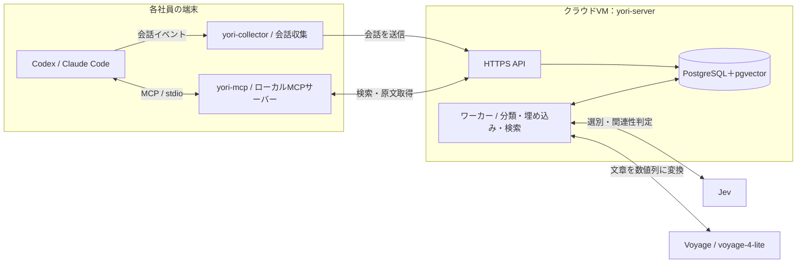
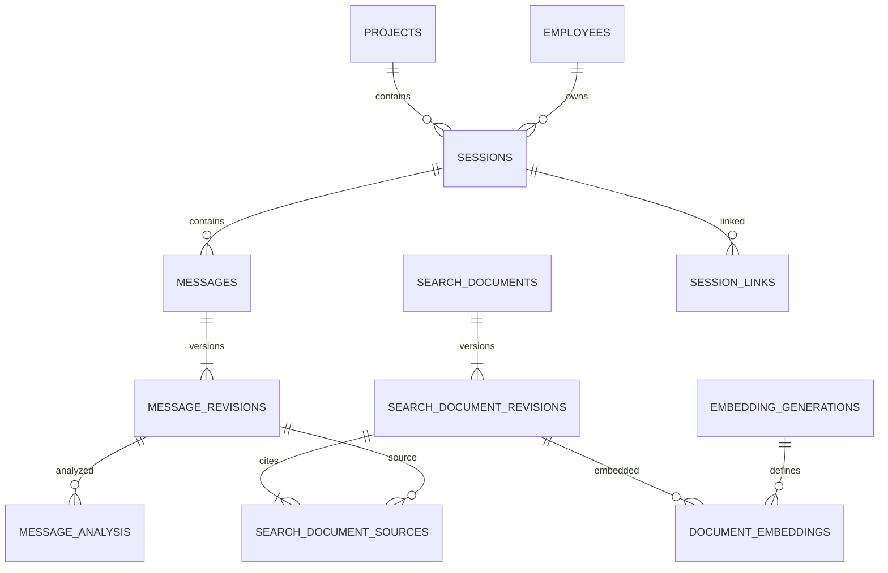
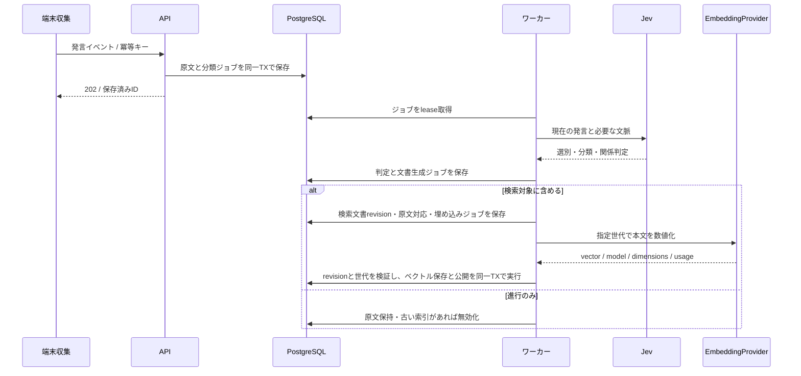
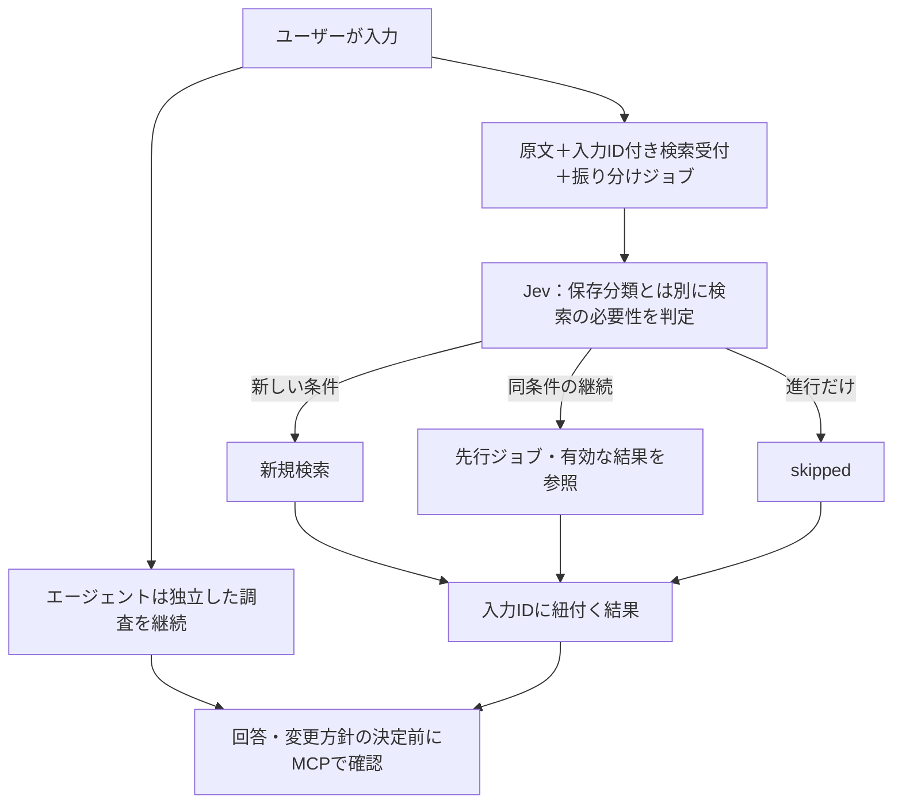
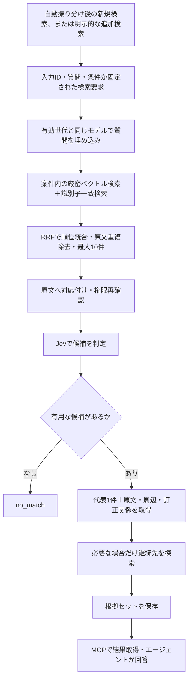

# yori — 社内開発会話の共有検索基盤：実装計画・仕様

- 文書作成日：2026-09-21
- 対象：Codex／Claude Code と社員の会話を集約し、別の社員・別のセッションから再利用する社内システム
- 文書の用途：別の実装エージェントへの引き継ぎ
- 状態：M1〜M3のローカル実装・合成fixture検証済み。M3にはユーザー指定の保留事項あり（12.1節）。M0の外部SDK確認とM4〜M8は残作業。実端末への導入・実データ送信・クラウド配置・性能検証は未実施
- 改訂方針：2026-09-21、管理型の記憶・検索サービスを採用せず、PostgreSQL＋pgvectorで自作する。旧MySQL＋Supermemory案は廃止。
- 用語：本書の「必須」は実装要件、「初期値」は設定変更可能な出発点、「将来」は今回の実装対象外

## 1. 目的と完成時の挙動

社員AがCodexまたはClaude Codeと行った会話を、社員Bが別のエージェント・別のセッションから検索できるようにする。

検索する内容は、設計判断・実装計画に限定しない。次を対象とする。

1. 実装背景、制約、採用理由、却下理由。
2. 類似したバグの症状、報告された原因、対応方法。
3. 類似した修正依頼に対して、過去にどのように対応したか。
4. 会話または短い対応記録に残された調査・修正・確認の手順。
5. セッションをまたいだ継続・引き継ぎ、および後続の訂正・撤回。

### 1.1 代表シナリオ

> 社員Aが「保存後に画面へ反映されない」不具合について、API応答、DB保存、画面更新の順に調査し、キャッシュの更新漏れを修正したと報告する。  
> 後日、社員Bが似た症状を相談すると、Aの会話・対応記録を検索し、症状、報告された原因、対応手順、発言者、日時、原文を返す。  
> 「今回も同じ原因」とは断定しない。今回に転用できる調査手順と、過去事例の事実を区別する。

### 1.2 完成の定義

- 2人以上の社員、2つ以上のセッション、両エージェントを扱える。
- プロジェクト内では社員横断で検索できる。
- 原文と発言者を保存し、検索結果から原文へ戻れる。
- Jevが会話の保存価値・区分・継続関係を判定する。
- 検索対象から除外しても、原文は自社DBに残る。
- 検索結果は原則として代表事例1件を返し、必要な根拠・周辺会話を付ける。
- 類似事例がない場合、または処理中の場合、それを明示する。
- 原文にない原因・手順・成功を生成して事実扱いしない。
- 非同期処理、再試行、重複防止が動作する。
- ユーザー入力を起点に検索を自動先行開始し、Jevが新規検索・再利用・検索不要を振り分ける。
- メインエージェントは独立した調査を続け、回答・変更方針の決定前に現在入力の結果を取得する。

## 2. 決定事項・作業上の既定値・対象外

### 2.1 ユーザーとの会話で確定した方針

| 項目 | 方針 |
|---|---|
| 利用目的 | 会社内の複数社員の開発会話を共有検索する |
| 収集対象 | ユーザー入力、AIの通常の発言、短い対応記録 |
| コード | 発言本文に含まれるコードは保持する |
| ツール結果 | ファイル読込内容、コマンド出力、テストログ、パッチ全文を自動収集しない |
| 選別 | Jevを使用する |
| 不要な短文 | 原文は保持し、進行のみの発言は通常検索対象から外す |
| 承認・撤回 | 短文でも判断を変える発言は残す |
| 非同期 | 分類・埋め込み生成・索引更新・検索をジョブとして処理する |
| 自動先行検索 | ユーザー入力受領時に検索受付を自動作成。Jevがnew_search / reuse / skipを判定。MCP呼出しを開始条件にしない |
| 自作範囲 | 文書分割・検索・順位統合・出典管理・再索引を自社コードで実装する |
| DB・検索 | PostgreSQL＋pgvector。Supermemory等の管理型記憶・検索サービスは使用しない |
| 外部AI | JevとVoyageの埋め込みAPI。EmbeddingProviderで交換可能にする。外部AIまで完全に内部化したとは表現しない |
| 学習利用 | 社内入力・出力のモデル学習利用を禁止。規約・設定の確認前に実データを外部送信しない |
| バックアップ | 今回は実装・設定しない |
| データ永続化 | バックアップとは別に必須。コンテナ再作成で消してはならない |
| DeepSeek | 初期版の必須依存にしない |
| 最終回答 | Codex／Claude Codeが根拠を読んで作成する |

### 2.2 本計画の作業上の既定値

以下は実装を止めないための既定値であり、ユーザーが全項目を個別指定したわけではない。

| 項目 | 既定値 |
|---|---|
| クラウド | AWS Lightsail、Linux VM 1台 |
| サーバー規模 | メモリ2 GBを開始候補とする |
| 人数 | 初期は少人数。検索内製化前の「2 GBで約5人」という見立ては適用しない |
| DB | PostgreSQL 18系＋pgvector。実装時に互換性を確認し、コンテナ・拡張の版を固定 |
| アプリ言語 | TypeScript／Node.jsの実装時点のサポート対象LTS |
| アプリ構成 | APIとワーカーは同一リポジトリ・別プロセス |
| DBアクセス | node-postgres（pg）によるパラメータ化SQLと明示的なマイグレーション |
| API | Fastify、入力・外部出力の検証にZod |
| 配置 | Docker Compose |
| 検索基盤 | pgvectorのcosine距離による厳密検索＋明示された識別子の完全一致検索 |
| 埋め込み | Voyage直接APIのvoyage-4-lite、1024次元、float。EmbeddingProvider経由 |
| 管理用DB接続 | SSHトンネル。DBポートを外部公開しない |
| 通常接続 | HTTPSの自作API。MCPはローカルの薄いアダプターから呼ぶ |

2 GBは開発・小規模導入の出発点で、人数や保存件数の保証ではない。検索とベクトル保存も同じVMで担当するため、外部検索を前提にした旧資源見積もりは無効とする。初期運用では埋め込み生成を外部APIに任せ、モデルをVMに載せない。埋め込みAPIはVoyage直接APIを使用し、学習利用拒否の確認を送信開始条件とする。既存の社内推論サーバーがある場合もEmbeddingProviderの同じ契約を使う。

リージョン、ドメイン、会社ID、社員ID、リポジトリ対応表、APIキーは環境設定とする。未指定でもローカル実装を進められるようにし、実クラウド作成・有料APIへの大量投入時にのみ必要な値を確定する。

### 2.3 今回は実装しないもの

- 全ツールログ・推論内部情報・システムプロンプトの収集。
- Supermemory等の管理型記憶・検索サービス、MySQLとの二重対応。
- 初期版のHNSW／IVFFlat索引、VM上でのローカルLLM・埋め込み推論。pgvectorの厳密検索は初期実装に含む。
- 完全分散型の同期・検索、Git互換の履歴管理。
- 専用の管理Web UI、SSO、複雑な権限管理。
- Kubernetes、Redis、専用のメッセージブローカー。
- 全会話を毎回読み直す要約。
- 自動バックアップ、冗長化、自動フェイルオーバー。
- 記憶の推定だけに基づくコード変更や自動実行。

## 3. 全体構成



### 3.1 責任分担

| 部品 | 責任 |
|---|---|
| 端末側収集 | 会話差分の取得、共通形式への変換、未送信イベントの保持・再送 |
| API | 認証、プロジェクト範囲の検証、原文保存、ジョブ受付・結果取得 |
| PostgreSQL | 原文・ベクトル・社員・セッション・分析・関係・ジョブの保存 |
| ワーカー | 順序制御、Jev呼出し、決定的な文書分割、埋め込み、索引更新、候補検索 |
| Jev | 定義済み選択肢・評価基準による判定。文章生成・埋め込み生成はしない |
| EmbeddingProvider | 渡された文書／質問を数値ベクトルへ変換する |
| エージェント | 短い対応記録の作成、根拠を使った最終回答 |

自社DBを正本とし、検索文書・ベクトルは原文から再構築可能な派生データとする。外部の記憶サービスに文書分割・索引管理・検索順位・保持方針を委ねない。判定用AIと埋め込みモデルはなお外部依存になり得るため、「すべて非ブラックボックス」とは表現しない。

### 3.2 埋め込みプロバイダーの契約

- インターフェース：embedDocuments(texts, generation)、embedQuery(text, generation)。
- 出力：入力ごとに対応したvector、実model識別子、dimensions、取得可能なusage。
- ベクトル件数・入力対応・次元・有限値・cosine用の非ゼロ性を検証する。
- model名だけでなく、tokenizer、query/documentプレフィックス、正規化、距離方式を世代に固定する。
- キャッシュキーは会社境界＋generation_id＋処理種別＋完全な入力のhash。キャッシュは出典を統合しない。
- 自前生成するダミーベクトルはテスト専用。未設定の本番環境で偽の意味検索を提供しない。
- 初期provider/model/dimensionsは3.3節で固定する。tokenizerの実装・対応SDK版は実装時に公式仕様へ照合し、世代へ記録する。
- APIキーや学習利用設定の確認が未完了でも、原文保存・分割・pgvector契約テストは外部APIキー不要のfixtureで実装を進める。
- pgvectorのvector(D)を使用する。初期設定では1〜2,000次元の範囲を契約とし、それ以上を黙って切り詰めない。

### 3.3 Voyageによる埋め込みの初期仕様

初期プロバイダーはVoyage AI直接API、モデルはvoyage-4-liteとする。MongoDB Atlas経由のAPIとは設定・規約を混同しない。Voyageは数値変換だけを担当し、会話の永続保存・検索はyoriのPostgreSQLで行う。

| 設定 | 初期値・契約 |
|---|---|
| provider | voyage_direct |
| model | voyage-4-lite |
| 出力次元 | 1024を明示指定。DBはvector(1024) |
| 出力型 | float |
| 距離 | cosine |
| 文書のinput_type | document |
| 質問のinput_type | query |
| truncation | false。長すぎる場合は分割して再実行 |
| 資格情報 | VOYAGE_API_KEY。中央ワーカーのみが保持し、社員端末に配らない |
| リランカー | Voyageの再ランキングは使用しない。候補評価はJev |
| API経路 | 公式の埋め込みAPIを呼ぶVoyageEmbeddingProviderを実装する |

input_typeによるプロバイダー側の文書／質問用前処理を使用し、同じ接頭文をアプリから重ねて追加しない。モデル名・次元・input_type・tokenizer／SDK版をembedding_generationに記録する。モデルの不変リビジョンが公開されない場合は、取得できた識別情報と仕様確認日を記録し、版が固定できたと偽らない。

数値化するのは新規・変更された検索文書と新しい質問。検索ごとに全履歴を再送しない。キャッシュは3.2節の世代と入力hashで管理する。公式がモデル間互換性を示す場合も、初期版では同じモデル・同じ次元で文書と質問を処理し、モデル変更は世代更新として扱う。

2026-09-21に確認した有料単価は100万入力トークンあたり$0.02。新規文書・質問・再索引・重複窓を含む送信量で計算する。無料枠は予算に算入しない。価格・利用条件は運用開始時に再確認する。

- [Voyage埋め込み仕様](https://docs.voyageai.com/docs/embeddings)
- [Voyage料金](https://docs.voyageai.com/docs/pricing)

### 3.4 社内データの学習利用禁止（必須）

ユーザーの採用条件は「社内の入力・出力を提供元のモデル学習に使用させないこと」。用語は「学習利用OFF／オプトアウトON」と統一する。学習不使用と処理後のデータ保持は別項目で記録する。

- Voyage直接APIは、社内データを送る前に対象アカウントのTerms of Serviceページで学習利用のオプトアウトを有効にする。支払い方法の登録が必要。
- 確認時点の規約では、オプトアウトは設定後の送信内容に適用され、その内容は処理後直ちに削除されると記載されている。設定前のデータに遡及すると扱わない。
- 無料クレジットは無効になる可能性がある。有料利用を前提にし、無料枠の維持のために学習利用を許可しない。
- Jevにも学習利用禁止を適用する。TypeSafeの確認時点の規約は事前同意なく顧客データをモデル学習用データセットに含めないとするが、保存・不正利用監視・テレメトリーの条件は別に確認する。ゼロ保持と表現しない。
- 承認記録をプロバイダー・アカウント参照・API経路に紐付ける。記録項目は規約URL／確認日、学習利用条件、保持条件、オプトアウト設定確認日時、確認者。APIキー本文や社内会話を証跡へ含めない。
- yori側の設定だけでVoyage側のオプトアウトを変更・証明できるとは扱わない。自動確認APIがなければ管理者の設定確認を必須とし、その限界を運用手順に記載する。
- 未設定・未確認・無効化されたプロバイダーへの実データ送信は、文書埋め込み・質問埋め込み・Jev判定・再試行・再索引の全経路で停止する。送信直前にも承認状態を確認する。
- 原文受付は継続できる。外部ジョブはblocked_policyとして保持し、承認後に明示的に再開する。検索要求はfailedと機械可読なprovider_policy_unverifiedを返し、no_matchにしない。
- アカウント・API経路・提供元の変更時は、旧承認をそのまま流用しない。失敗時に未確認の別プロバイダーへ自動迂回しない。
- 設定が確認できるまでは、合成fixtureとモックで開発・テストする。社員の実会話を疎通確認に使用しない。

この文書はアカウント設定済みという証明ではない。実際の設定操作・社内データ送信は未実施。

- [Voyage直接APIの利用規約・第3条と設定手順](https://www.voyageai.com/tos)
- [TypeSafeの顧客データ利用条件・第4条](https://typesafe.ai/legal/mca)

### 3.5 yoriの実体と導入先

yoriは単体のMCPツール名ではなく、以下の3部品を合わせた社内会話検索システムである。MCPはCodex／Claude Codeへ機能を公開する通信上の窓口であり、DB・検索処理そのものではない。

| 部品 | 配置先 | 起動・責任 |
|---|---|---|
| yori-server | クラウドVM | API・ワーカー・PostgreSQLをComposeで起動。保存、分類、埋め込み、検索、原文取得を担当 |
| yori-collector | 各社員の端末 | フック等から起動し会話差分をHTTPS送信。未送信キューを保持。MCP呼出しがなくても収集できる |
| yori-mcp | 各社員の端末 | エージェントがstdioのMCPサーバープロセスとして起動。search_history等を公開し、中央APIを呼ぶ |

名称はコンポーネント名であり、初期版から3つの独立した公開パッケージに分ける必要はない。1リポジトリ・1配布パッケージ内の別起動モードでよい。社員端末には中央APIの接続設定と本人用のyori認証情報だけを配る。

導入作業は「中央サーバーを1つ立てる」「各端末へ収集フックを設定する」「各エージェントにyori-mcpを登録する」の3段階。MCPを登録しただけでは会話自動収集が完成しない。中央側はHTTPS APIとして公開し、初期版でリモートMCPの別認証・別公開サーバーを追加しない。

## 4. 収集する情報と取り込まない情報

### 4.1 収集単位

- ユーザー発言、AIのユーザー向け発言を1メッセージとして保存する。
- 途中経過の説明も収集対象とし、Jevの選別で索引化の可否を判断する。
- ストリーミングの途中断片を別発言として増殖させない。完成した発言、または同じ発言IDの更新として扱う。
- エージェントのhidden reasoningや内部推論は収集対象にしない。
- 日時はUTCで保存し、表示時のみ利用者のタイムゾーンに変換する。
- メッセージ順はセッション内sequence_noで管理する。UUIDや受信日時から推定しない。

### 4.2 エージェント別アダプター

実装前に対象バージョンの公式フック仕様と、実際のログ形式を確認する。

- フックは収集開始の契機として使用する。
- フック入力だけで本文を取得できない場合は、そのセッションの会話ログから未取得分を読む。
- CodexとClaude Codeのログパーサーを分離する。
- 形式が変わったとき、未知のレコードを会話として誤収集しない。診断情報を残す。
- Codexのtranscript形式は安定した公開契約とみなさない。
- 再開・ログ切替・コンパクション時の重複要約を、新しい本人発言と誤認しない。
- 元の社員IDは収集端末の登録情報から確定する。本文中の名前から推定しない。
- 社員ID・会社IDはサーバー側の認証情報と照合する。

### 4.3 プロジェクトの特定

リポジトリの登録済み識別子とproject_idの対応表を使用する。ローカルディレクトリ名だけでプロジェクトを決めない。リモートURLの認証情報を保存しない。

同一リポジトリの別worktreeは同じプロジェクトにできる。未登録のリポジトリは誤って既存案件へ送らず、端末側で保留する。個人の全会話フォルダーを無条件にアップロードしない。初期収集は登録済みプロジェクトに限定する。

## 5. データ構造

### 5.1 IDと取り込みの規則

- 内部IDはUUIDv7をアプリで生成する。PostgreSQLのuuid型に保存する。日時はtimestamptz、可変の分析結果はjsonbを使用し、主要な識別子・状態・検索条件は独立カラムにする。
- 外部サービスのセッションID・メッセージIDは別カラムに保存する。
- 同じ文でも、別社員・別時刻の発言は別レコードとする。
- 本文ハッシュは差分検知・再処理防止に使う。発言の同一性は取り込み元IDで判断する。
- 発言編集に対応するためmessage_revisionsを保持する。根拠はメッセージIDとrevision番号を指す。
- ハッシュ対象の文字コード・改行・JSON正規化を固定し、方式を文書化する。
- source_message_idがない形式では、ログ内の安定したイベント識別子・位置等から生成する。テキストハッシュだけでは代用しない。

### 5.2 必須テーブル

| テーブル | 必須情報・責任 |
|---|---|
| companies | 会社ID |
| employees | 会社ID、社員ID、表示名 |
| projects | 会社ID、プロジェクトID、リポジトリ識別子、active_generation_id |
| project_members | 社員と検索・送信可能なプロジェクトの対応 |
| sessions | project_id、employee_id、source、source_scope、source_session_id、開始日時 |
| messages | session_id、source_message_id、sequence_no、role、発言日時、現在revision |
| message_revisions | message_id、revision、原文、content_hash、受信日時 |
| message_analysis | message_id、revision、選別、区分、関係判定、model_version、policy_version |
| message_relations | 接続元・接続先の発言revision、関係種別、明示／推定、根拠、判定版 |
| session_links | 元・先セッション、引き継ぎ根拠、明示／推定、状態 |
| search_documents | 文書ID、company_id、project_id、session_id、document_key、desired_revision、is_searchable |
| search_document_revisions | 文書ID、revision、決定的に構築した検索本文、content_hash、chunker_version、索引状態 |
| embedding_generations | 世代ID、provider/modelの版、dimensions、metric、tokenizer版、document/queryの前処理版、状態 |
| document_embeddings | 文書ID、revision、generation_id、埋め込みvector、入力hash、作成日時。混在次元は世代別物理テーブルで扱う |
| document_publications | 文書ID、世代ID、revision（公開revision）、staleフラグ。検索要求が固定した世代の公開状態を保持 |
| document_entities | 文書revision、会社・案件、entity_type、entity_key。ファイル・関数・Issue等の明示された識別子 |
| search_document_sources | 検索文書revisionと原文revisionの対応、原文内の文字範囲、表示順、引用／生成メタデータの区別 |
| jobs | 種別、対象、status、lease、attempts、next_run_at、エラーコード、冪等キー |
| search_requests | 質問、会社・案件・社員・セッション、input_id・input_revision・input_sequence_no、trigger（auto/manual）、条件hash、policy_version、request_id、status、outcome、search_action、reused_from_request_id、結果、処理段階、作成・失効日時 |
| provider_policy_approvals | プロバイダー・アカウント参照・API経路、規約確認日、学習・保持条件、設定確認者・日時、有効状態。資格情報本文は保存しない |
| usage_events | プロバイダー、操作、入力・出力usage、所要時間、成否。本文は入れない |

認証用トークンはハッシュで保持し、社員・会社・許可プロジェクトに対応させる。複雑なアカウント管理UIは不要だが、呼出元を識別せず任意の社員IDを名乗れるAPIにはしない。

### 5.3 初期インデックス

- sessions：UNIQUE(source, source_scope, source_session_id)
- sessions：(project_id, employee_id, started_at, id)
- messages：UNIQUE(session_id, source_message_id)
- messages：UNIQUE(session_id, sequence_no)
- message_revisions：UNIQUE(message_id, revision)
- message_analysis：UNIQUE(message_id, revision, policy_version)
- message_relations：接続元・接続先にそれぞれインデックス
- session_links：接続元・接続先にそれぞれインデックス
- search_documents：UNIQUE(project_id, document_key)、(company_id, project_id, session_id)
- search_document_revisions：UNIQUE(document_id, revision)
- document_embeddings：UNIQUE(document_id, revision, generation_id)。各世代テーブルでvector(D)の次元を固定
- document_publications：UNIQUE(document_id, generation_id)
- document_entities：(company_id, project_id, entity_type, entity_key)
- search_document_sources：文書revision側と原文revision側にそれぞれインデックス
- jobs：UNIQUE(idempotency_key)、(status, next_run_at, priority)
- search_requests：(project_id, created_at)
- search_requests：自動受付は(input_id, input_revision, policy_version)にtrigger=autoの部分UNIQUEインデックス。手動再送は社員・入力revision・条件hash・idempotency_keyで冪等化する
- 同じ入力・条件に対する自動受付と通常のsearch_historyは、入力revision単位の短い行ロックで照合し、既存受付を返す。force_refreshは明示された追加検索として別管理

分類の各ラベルに単独インデックスを大量追加しない。必要なアクセスパターンが出てから追加する。



## 6. Jevによる選別・分類

### 6.1 判定入力

現在の発言、直近の会話、関連しそうな直前の提案・承認を渡す。初期設定は直前最大6メッセージ、総入力8,000トークン相当を上限とする。

上限はプロバイダーの仕様上限とは別のアプリ予算である。長文は分割し、現在の発言を黙って切り捨てない。分割後の判定は原文位置と対応させる。文脈不足はunknownとする。

### 6.2 独立した質問

| 出力 | 選択肢・規則 |
|---|---|
| retention | substantive / decision_signal / progress_only / unknown |
| primary_intent | requirements / design / implementation / explanation / investigation / bugfix / review / test / refactor / operation / handoff / other / unknown |
| technical_labels | frontend / backend / database / infrastructure / cicd / security / mobile / data_ml / devtools / other。複数可 |
| decision_action | propose / accept / reject / revoke / change / none / unknown |
| continuity | same_topic / new_topic / multiple_topics / unknown |
| search_action | new_search / reuse / skip。保存価値とは独立し、9.0節の条件で確定 |
| relation_target | 入力で渡した候補発言ID、none、unknownから選択 |
| statement_status | request / proposal / approval / reported_completed / reported_verified / unknown |

同じstateから答えられる質問は1回のJev呼出しにまとめる。一つの回答を同一呼出し内の別質問が読めるとは扱わない。自由文や新しいIDをJevに生成させない。

confidenceは正答率ではない。採用閾値は設定化する。初期の自動処理閾値は0.8を仮値とし、低信頼の除外・関係確定を避ける。閾値未満はunknownとして原文を保持する。モデルが返す型・候補IDを必ず検証する。

### 6.3 選別規則

| 発言 | 規則 |
|---|---|
| 「続けてください」 | 条件や判断の追加がなければprogress_only |
| 「その案で実装してください」 | decision_signal。提案との関係を保持 |
| 「その案は取り消し」 | decision_signal。撤回対象を保持 |
| 「毎分100件までにしてください」 | substantive |
| 「確認します」 | 通常はprogress_only |
| 「テストは通りました」 | reported_verified。実行証跡確認済みとはしない |
| 「はい」 | 直前の質問により判定。短さだけで除外しない |
| 「それは違う」 | 対象を確定できなければunknown |

progress_onlyのみ通常の索引対象から外す。unknownは周辺原文とともに索引化し、未確定と明示する。承認対象が未確定なら、近傍の提案を勝手に確定関係にしない。

## 7. 短い対応記録

生のツール結果は収集しない。作業したエージェントが、バグ修正・調査・実装の一区切りで短い記録を提出する。

- 毎ターン生成しない。
- 目安は日本語600文字以内。長ければ拒否せず、設定上限と警告で管理する。
- 必須項目は「問題／依頼」「対応」「確認状態」。
- 任意項目は「原因」「調査手順」「失敗した試み」「制約」「関連ファイル・PR」。
- 記憶にない手順を再構成させない。未確認・不明を許容する。
- 記録はagent_reportとして保存する。人間の原文やツール証跡と混同しない。
- 原文に対応する発言IDがあれば引用する。根拠が短い報告だけなら、その報告を出典とする。
- 同じ作業の更新はrevisionとして扱う。訂正前の記録への参照を壊さない。

例：

```text
問題：保存後、画面に変更が反映されない。
原因：保存後にキャッシュが更新されなかったと判断。
調査：API応答、DB保存、画面更新の順に確認。
対応：保存成功時にキャッシュを無効化。
確認：関連テスト成功とエージェントが報告。実画面は未確認。
```

DeepSeekによる全量要約は不要。まずエージェントが提出した対応記録と選別原文を検索する。

## 8. 保存・埋め込み・索引更新フロー



### 8.1 ジョブ制御

- 原文保存とジョブ追加は同一トランザクションで行う。
- ジョブ確保は短いSELECT FOR UPDATE SKIP LOCKEDとlease更新で行い、外部API待ちの間は行ロックを持たない。
- 再実行に備え、完了更新にはlease所有トークンと対象revisionの一致を要求する。
- 同一セッションの分類は前の処理が完了してから進める。SKIP LOCKEDだけでセッション順序が保証されるとは扱わない。
- ワーカー停止後はlease期限切れで回収。指数バックオフ・ジッター・Retry-Afterに対応する。
- 永続エラーはfailedとして保持し、再試行CLIを提供する。学習利用条件が未確認ならblocked_policyとし、外部送信を伴う自動再試行を止める。
- 初期外部処理並列数は検索1・分類／埋め込み1の合計最大2。検索を取り込みより優先する。
- 外部モデル待ちとDB処理時間を別計測する。分類失敗で原文を捨てない。
- 索引未反映のpending_documentsとfailed_documentsは会社・案件に限定して返す。

### 8.2 決定的な検索文書生成

- 自社コードで、選別原文をセッション内の順序でまとめる。自由生成の要約は初期版に使わない。
- 初期値は目標800、上限1,200トークン、長文分割の重複100トークン。埋め込みモデルの文書プレフィックスも上限計算に含める。
- tokenizerは選定モデルに対応するものを使う。APIと完全一致しない場合は上限に余裕を設け、切り捨てず再分割する。
- 境界はメッセージ、段落、コードブロックの順で優先する。上限を超える単一ブロックのみ原文位置付きで分割する。
- 各文書revisionに原文ID・revision・文字範囲・表示順を保持する。重複窓は出典の二重カウントを避ける。
- document_keyはセッションID、先頭原文IDと位置、chunker_versionから決定的に生成する。後続追加で確定済み文書を無駄に再生成しない。
- 長くならない末尾文書のみ更新し、新revisionで再埋め込みする。
- 検索本文には原文と短い分類ラベルを含められるが、生成メタデータを原文の引用として表示しない。
- ファイル・関数・Issue・PRは明示された識別子だけをdocument_entitiesへ登録する。推定関係とは区別する。
- 同一入力hash・世代の再処理はキャッシュを利用する。同じ文章でも発言者・原文の対応は残す。
- 誤分類の訂正、原文編集、chunker変更は再生成対象。最新として取得する対象を古い分析で上書きしない。

### 8.3 文書の公開と再索引

文書revisionの状態はpending / embedding / ready / failed / superseded / excludedとする。

1. 新revisionは未公開で構築する。正常な更新では旧ready版を新ready版への切替まで使えるが、古い情報として結果に警告を付ける。
2. 原文の撤回・除外など旧版を返してはならない変更では、旧版を先に無効化し、更新待ちを返す。
3. 応答受信時にdesired_revision、世代、入力hash、lease所有を検証する。一致した場合だけベクトル保存・document_publicationsの公開revision更新を同一TXで行う。
4. モデル・次元・前処理変更は新しいembedding_generationを作る。次元ごとにvector(D)を持つ世代別物理テーブルをマイグレーションで生成し、モデル同士を同じ検索で比較しない。
5. 再索引中も旧世代で通常検索を続け、新旧両世代の文書更新を追従させる。
6. 切替直前に対象プロジェクトの索引公開を短時間同期させ、現在の検索対象revisionが新世代ですべてreadyであることを確認してprojects.active_generation_idを原子的に変更する。
7. 検索要求は開始時の世代IDを固定し、そのモデルで質問を埋め込み、同じ世代を検索する。実行中リクエストが参照する旧世代は削除しない。
8. 新世代失敗時は旧世代の利用を継続する。新旧世代の同時保存容量も計測する。旧世代の削除は明示CLIで行う。

## 9. 検索・周辺探索

### 9.0 自動先行検索（標準動作）

ユーザーが新しい入力を送信したら、エージェントからのMCP検索呼出しを待たず、収集イベントを起点に検索の準備を開始する。

#### 入力受付と開始タイミング

- 提出済みのユーザー入力だけを自動検索の起点にする。AIの途中発言・対応記録・ツール結果・コンパクション要約で再起動しない。
- input_idはユーザーメッセージの内部ID、input_revisionはその本文revisionとする。端末のsource_session_id・source_message_idから同じIDを再取得できるようにする。
- POST /v1/eventsは原文、当該入力専用search_request、検索振り分けジョブを同一トランザクションで保存する。再送では既存の同じ受付を返す。
- 自動検索は、元会話の分類・文書生成・埋め込み完了を待たない。入力時点の質問と直前会話を使用する。
- 提出時フックは原文送信・受付IDの受領だけを短時間で行い、AI判定・検索完了を待たない。ネットワーク受付が遅い場合は端末キューへ退避してエージェントの処理を継続する。
- 端末アダプターは、現在のセッション・入力に紐付く検索受付情報または受付未確認をエージェントへ渡す。対応する公式フックでID注入できない環境では、その入力の外部メッセージIDによるMCP取得を使う。
- 検索の自動開始は「中央で入力イベントを受領後」が保証範囲。端末オフライン中に中央検索が開始したとは表示しない。

#### Jevによる検索振り分け

保存価値と再検索の必要性は独立した判定である。retentionがdecision_signalでも、新しい検索が必要とは限らない。

| search_action | 条件 | 処理 |
|---|---|---|
| new_search | 新しい質問・症状・依頼・制約・対象がある | 自動検索ジョブを登録 |
| reuse | 同じ話題で検索条件に変化がなく、有効な先行検索がある | 当該入力の受付から先行request_idへ参照を張る |
| skip | 進行だけの指示で検索を必要としない | completed / skippedにする |

判定に必要なstateを共有できるときは、保存分類と検索振り分けを1回のJev呼出しにまとめる。ただし、通常の取り込み待ち行列で先行検索を止めない。処理を分けた場合は同じ入力・文脈・policy版の結果を再利用できるようにする。

- 不確実な判定はnew_searchを既定とし、進行のみと確信できない入力を無条件skipしない。
- 「その案で実装して」は承認として保存し、条件不変ならreuseする。
- reuse対象は同一会社・案件・社員・セッションで、Jevが継続と判定し、質問の対象・制約が変わっていない直近の検索。初期の結果有効期間は10分。
- pending/runningの検索も共有できる。completedはmatchedかつ有効期限内の結果のみ再利用する。failed/expired/skipped/no_matchや再利用対象不明ならnew_searchへ進む。
- 再利用結果のoriginal_request_idと現在のinput_idを両方返す。結果を新しい検索で得たものと偽らない。
- 再利用時も現在の権限と出典の無効化を確認する。新たな条件・訂正がある場合は再検索する。
- Jev障害・ポリシー未承認はfailedと理由を返す。未確認の別AIへ切り替えず、原文は保持する。
- 新しい入力が来ても旧結果を書き換えない。旧結果は入力IDで隔離し、現在入力への通知として流用しない。
- 現在の入力と、その入力以降に生成された同セッションの発言を、自動検索の根拠にしない。候補は検索要求のinput_sequence_noより前の同セッション発言か、他セッションの対象データとする。



### 9.1 検索範囲

- company_idとproject_idは必須。
- 社員横断検索が標準。質問者本人のemployee_idで絞らない。
- author_idはユーザーが発言者を指定した場合のみ追加する。
- 現在の質問そのもの、およびそれだけを引用した文書は候補から外す。
- 区分は原則として順位調整に使用し、厳格な絞り込みで根拠を消さない。
- 現在のファイル・機能・直前会話を任意の質問補助情報として渡せる。
- 閲覧範囲はサーバー側で強制し、モデルの判断には任せない。

### 9.2 検索フロー




### 9.2.1 自作検索の契約

初期版は案件で絞った厳密ベクトル検索と、明示された識別子の完全一致検索を行う。日本語の全文検索がPostgreSQLの標準設定だけで十分に動くとは仮定しない。日本語全文検索エンジンやpg_trgmは将来の追加候補で、初期必須にしない。

1. 実行開始時にプロジェクトのactive_generation_idを固定する。
2. 質問と必要な直近の文脈を、その世代のquery前処理で埋め込む。履歴全文は送らない。
3. 会社・案件・検索可能revision・世代で絞り、cosine距離の小さい順に最大20件を取得する。候補が少なければその件数で返す。
4. 質問や明示された対象情報にファイル・関数・Issue等がある場合、同じ会社・案件で完全一致検索し最大20件を取得する。
5. 両経路をRRF（各経路の順位rに対して1/(60+r)を加算）で統合する。同じ文書revisionを1件にまとめ、同点は文書IDで安定順序にする。
6. 同じ原文範囲を大量に重複投入しないよう候補をまとめ、上位最大10件をJevへ渡す。Jevへ送る合計本文は初期8,000トークン相当までとし、除外・切り詰めは結果に記録する。
7. Jevが有用性を判断し、代表1件と必要な根拠を返す。

距離は関連性の確率ではない。相対的に近いだけの候補も含むため、最終採用はJevの判定と出典状態に基づく。氏名・ID・日時などの事実表示はDBから取得する。

以下は意味を示すSQL例。実装では世代テーブル名を登録済み内部識別子から選び、外部入力をSQL識別子へ直接展開しない。$1〜$5は値パラメーター。

```sql
WITH scoped AS MATERIALIZED (
  SELECT e.document_id, e.revision, e.embedding
  FROM embeddings_generation_g1 AS e
  JOIN search_documents AS d ON d.id = e.document_id
  JOIN document_publications AS p
    ON p.document_id = e.document_id
   AND p.generation_id = e.generation_id
   AND p.revision = e.revision
  WHERE d.company_id = $1
    AND d.project_id = $2
    AND d.is_searchable = true
    AND e.generation_id = $3
)
SELECT document_id, revision, embedding <=> $4::vector AS distance
FROM scoped
ORDER BY distance ASC, document_id ASC
LIMIT $5;
```

この例のg1はサンプル世代名。$3は検索開始時に固定した世代IDであり、その世代テーブルを参照する。document_publications.revisionは当該世代の公開revisionである。ベクトル検索と識別子検索は短いREPEATABLE READトランザクション内で同じ公開状態を読む。外部APIをこのトランザクション内で呼ばない。切替後のprojects.active_generation_idで再び絞って旧世代要求を空結果にしない。原文返却時にも案件範囲・無効化状態を再確認する。

埋め込みAPI障害時はfailedを返す。識別子検索だけに黙って落として通常の検索結果を装わない。将来の部分検索モードを追加する場合は、契約にdegradedを明示して別途実装する。


### 9.3 候補判定

Jevは以下を独立に評価する。

- 質問の対象と一致するか。
- 症状または修正依頼が似ているか。
- 環境・制約が近いか。
- 実装理由の根拠になるか。
- 解決方法または調査手順を再利用できるか。
- 単なる提案か、完了・検証の報告があるか。

Scoreの初期基準は「無関係／周辺的／有用／直接答える」の4段階とする。代表候補は有用以上を条件とする。信頼度だけで順位付けしない。生の判定結果と採用理由コードを残す。

症状の類似を原因の一致とみなさない。手順の有用性と、解決済みという状態を別に返す。

### 9.4 前後・引き継ぎ探索

初期値：

- ヒットした会話の前後2ターン。
- 推定候補は同社員・同プロジェクトの前後各3セッション。
- 最大3ホップ、合計最大10セッション。
- 最終返却のコンテキスト予算は約6,000トークン相当。
- 明示リンクを優先する。
- 他社員への引き継ぎは明示リンクや共通Issue／PRを使用する。
- 各拡張で元の質問と継続元の両方に照らして関連性を判定する。
- 循環・訪問済みIDを検出する。
- 上限到達はtruncatedとして返す。全探索済みと表現しない。
- セッションの時間隣接だけで同じ案件と確定しない。

後続の撤回・訂正リンクは代表候補と一緒に取得する。「1件返却」は後続訂正を隠す理由にしない。初期版はすべての矛盾を自動発見するとは約束しない。

## 10. APIとMCPの契約

### 10.1 HTTP API

| API | 動作 |
|---|---|
| POST /v1/events | 原文を永続保存。提出済みユーザー入力では検索受付・振り分けジョブも同一TXで登録し、input_id・revision・request_idを202で返す。AI発言では自動検索を作らない |
| POST /v1/session-links | 明示的引き継ぎの登録 |
| POST /v1/searches | 明示検索。現在入力と同条件なら自動受付を再利用し、異なる条件／force_refreshなら追加検索を作る。request_idを返す |
| GET /v1/searches/by-input | セッション＋input_id・revision、または認証済み取り込み元の外部入力IDで自動受付を照合する。未受付はnot_receivedでありno_matchではない |
| GET /v1/searches/:id | 処理状態と結果の取得 |
| GET /v1/evidence/:id | 原文revision・発言者・周辺会話の取得 |
| GET /health/live | プロセスの生存 |
| GET /health/ready | DB等、受付に必須の依存状態 |

イベントは複数件のバッチを許容する。リクエストサイズを制限し、長いセッションは分割送信する。イベント再送時は同じ冪等キーに対して同じローカルIDを返す。

### 10.2 MCPツール

| ツール | 契約 |
|---|---|
| search_history | 明示検索／追加調査用。入力ID・revision・条件を渡す。同条件の自動検索があれば再利用し、なければ同じ入力の受付を作る。force_refreshは明示指定のみ |
| get_search_result | request_idまたは現在の入力識別子で自動／手動結果を取得。現在input_idを検証し、最大5秒のlong-pollを許容。未受付・検索不要・処理中・失敗を区別 |
| get_evidence | 出典IDから詳細原文を取得 |
| record_case | 作業エージェントが短い対応記録を提出 |
| link_session | 引き継ぎ元が明示されている場合に関係を登録 |

MCPアダプターはローカルstdioを基本とし、共通HTTPS APIを呼ぶ。stdioの標準出力に診断ログを混ぜない。

### 10.3 検索結果の必須フィールド

```json
{
  "request_id": "uuid",
  "input_id": "uuid",
  "input_revision": 1,
  "trigger": "auto",
  "search_action": "new_search",
  "reused_from_request_id": null,
  "status": "completed",
  "outcome": "matched",
  "project_id": "uuid",
  "index_status": {
    "pending_documents": 0,
    "failed_documents": 0,
    "embedding_generation_id": "uuid",
    "search_mode": "exact_vector_and_entity"
  },
  "matches": [
    {
      "case_or_document_id": "uuid",
      "relevance_kind": ["similar_symptom", "reusable_procedure"],
      "claim_status": "agent_reported",
      "evidence": [
        {
          "message_id": "uuid",
          "revision": 1,
          "employee_id": "employee-a",
          "role": "assistant",
          "occurred_at": "2026-09-21T01:00:00Z",
          "text": "保存後にキャッシュを無効化する修正を行いました。"
        }
      ],
      "related_evidence_ids": [],
      "truncated": false
    }
  ],
  "warnings": []
}
```

- status：pending / running / completed / failed / expired
- completedのoutcome：matched / no_match / skipped
- reused_from_request_idがある場合、現在入力の受付IDと参照先検索IDを区別し、参照先の進捗を追跡する。
- 未受付照合はnot_receivedとして返し、既存search_requestのstatusとは別の照合状態とする。
- 外部障害をno_matchに変換しない。
- claim_statusは報告の種類を表す。実行ログを保存しない本構成で「実証済み」と表示しない。
- confidenceを正答率として表示しない。
- IDを知っているだけで他プロジェクトの原文を取得できないようにする。

### 10.4 非同期結果を回答へ使う規則

検索の開始はユーザー入力イベントを起点とする（9.0節）。MCPは自動検索の結果取得と、明示的な追加検索を担当する。

- 背景・過去の採用理由の質問：結果を取得してから、過去の事実を説明する。
- バグ修正・実装依頼：検索中は現コードの読解・症状確認を進め、変更方針の決定・編集開始前に結果を確認する。
- 取得は現在のinput_id＋revisionに紐付ける。接続全体の「最後の検索」を使わない。
- get_search_resultは1回最大5秒のlong-poll、会話を止める累計待機予算は初期10秒とする。連続した高頻度ポーリングをしない。これらはAPIのSLAではなくクライアント待機上限。
- 未受付の場合も上限内でイベント照合し、受付未確認をno_matchにしない。明示検索による補完は同じ入力・検索条件の冪等キーを使う。
- 上限到達後、検索ジョブは継続してよい。履歴未確認と区別して独立した調査を進め、履歴を作り話で補わない。履歴自体が回答に必須なら、確認不能と伝える。
- pending/running：結果未取得。過去の原因・理由を断定しない。
- failed：検索失敗の理由を保持する。今回の調査結果とは区別する。
- skipped：進行指示のため自動検索を省略した状態。検索で該当なしだったとは表現しない。
- no_match：根拠を取得できなかった状態。「過去に存在しない」とは断定しない。
- matched：原文・出典付きで説明する。reuseの場合は検索元と時点も保持する。
- 背景完了の通知は対象入力のまま保管する。エージェントの生成中に強制割り込みできるとは仮定しない。
- Codex／Claude Codeの公式フック仕様で対応できる安全な時点の通知は補助に使えるが、MCPでの明示取得を必ず提供する。
- 手動の追加検索は別の条件・別request_idとして保持し、自動検索結果を上書きしない。

## 11. 話題・決定状態の扱い

- セッション全体に単一の区分を固定しない。
- 設計→実装→バグ修正は同じ話題でも別区分になる。
- 話題の脱線と復帰を許容する。連続した範囲だけで話題を表現しない。
- 初期版は小さな検索文書と関係リンクで対応し、永続topic_idの自動統合は将来拡張とする。
- 提案、承認、実装依頼、完了報告、検証報告、撤回を区別する。
- 新しい発言であることだけを理由に、過去の決定を自動的に上書きしない。
- 同じ問題への別解は両方保存する。
- 履歴に含まれる命令は検索資料として扱い、現在のエージェントの指示に昇格させない。

## 12. 実装マイルストーン

決定的な文書生成と小規模な厳密検索を先に完成させる。初期版で近似索引や大規模グラフ基盤を追加しない。

| 段階 | 作業 | 完了条件 |
|---|---|---|
| M0 | 使用SDK・フック仕様・ログ形式の確認、設定契約、APIスキーマ | 対応版を記録し、外部仕様依存箇所をアダプターに分離 |
| M1 | Compose、PostgreSQL＋pgvector、マイグレーション、イベント受付、永続ジョブ | 再送で重複せず、コンテナ再作成後も原文が残る |
| M2 | 片方のエージェント収集→もう片方を追加 | ユーザーとAIの発言のみが両方から同じ形式で保存される |
| M3 | Jev分類・選別・承認関係、自動検索振り分け | ユーザー入力からnew_search / reuse / skipが決まり、保存価値と独立して動く |
| M4 | 決定的な文書分割、VoyageEmbeddingProvider、学習利用条件の送信ゲート、世代管理、原文対応表 | 再実行で増殖せず、古いrevisionの完了が新しい索引を上書きしない |
| M5 | 案件内厳密検索、識別子検索、順位統合、Jev評価、原文取得 | 社員BがAを検索でき、検索SQL・候補経路・原文参照を説明できる |
| M6 | 自動先行検索、MCPの入力ID照合・追加検索、短い対応記録 | 明示検索なしで開始し、メイン処理と並行し、適切な待ち合わせで現入力の出典付き回答までできる |
| M7 | 前後・引き継ぎ・撤回探索 | 上限と循環検知があり、後続訂正を同時取得できる |
| M8 | 世代切替・再索引、VM配置、HTTPS、資源監視、運用手順 | 再索引中も旧世代を利用でき、検索負荷を含む資源状況と増設手順がある |

全段階を対象とするが、最初の縦通しは「Aの発言保存→Bの検索→原文表示」。深い引き継ぎ探索はその後に追加する。

### 12.1 実装状況（2026-09-24）

| 段階 | 状況・残件 |
|---|---|
| M0 | API受付契約とM2のフック仕様・実ログ構造を確認。Jev/Voyage/MCPのSDK・外部仕様確認は各工程で継続 |
| M1 | 実装済み。イベント受付・認証・冪等保存・revision・永続ジョブ・自動検索受付・Compose・原文永続化 |
| M2 | ローカル実装済み。両アダプター・登録案件の判定・SQLite未送信キューと読取位置・再送・診断CLI。合成fixtureから既存API/DBまで検証。導入は[収集手順](docs/collector.md)、確定仕様は[実装契約](docs/collector-design.md) |
| M3 | ローカル実装済み。Jev分類・選別・関係保存、new_search/reuse/skip振り分け、評価cache、送信承認、2 lane worker・再試行CLI。合成HTTPと実PostgreSQLで検証。運用は[worker手順](docs/worker.md)、確定仕様は[実装契約](docs/m3-design.md)。build_documents/execute_searchは待機jobの登録まで |
| M4〜M7 | 未実装。文書分割・埋め込み、検索、MCP、入力時点の自動先行検索の取得・通知、関連根拠探索 |
| M8 | 未実装。再索引・世代切替・VM配置・HTTPS・資源監視・性能検証 |

検証: 収集単独63件、既存API/DBと収集を含む130件が成功。配置・永続化7件、typecheck/lint/buildも成功。外部AIへ実データ送信なし。対応確認版はCodex Desktop `0.155.0-alpha.9.2`とClaude Code `2.1.220`。未知版は保留。実Gitの既存repository解決は確認したが、実worktree作成のスモークは環境の`.git`保護により未確認。Stop時点でまだログにない発言は次のhookまたは明示flushで回収するため、M6の即時検索完了とは扱わない。

ユーザー選択に基づき、リポジトリ識別子上限、不正UTF-8の非送信、元worktree消失後の保存済みキュー再送を修正。同一発言IDの過去本文を含むログの再読込による改訂増殖は、通常運用での発生条件が未確認のため修正保留。詳細は収集手順の既知の制限を参照する。

M3追加後の検証: API/DB・収集・workerを含む178件、配置・永続化7件が成功。typecheck・変更pathのlint・buildも成功。Jevの実API・実会話は使用せず、公式HTTP契約に合わせた合成fixtureで検証。成功ヘッダー受信後の本文受信timeout/通信切断が恒久失敗になる問題は、ユーザー指定により保留。原文は保持され、明示retryで再開する。複数partが同じ関係を示す場合の根拠範囲の統合と、正常応答の本文受信時間の計測も今回の対象外。詳細は[worker手順の保留事項](docs/worker.md)を参照する。

## 13. 必須の受け入れ条件

以下は実装の契約を確認する条件であり、AIの100%精度を要求するものではない。外部呼出しは契約テスト用の応答を固定できる構成にする。

| ID | 条件 |
|---|---|
| A01 | AとBの会話が同じ案件へ保存され、BからAを検索できる |
| A02 | 異なる案件の文書・出典を返さない |
| A03 | 「続けて」の原文は残り、progress_only判定なら索引から外れる |
| A04 | 「その案で進めて」が承認と判定された場合、対象提案を保持する |
| A05 | 対象不明の承認を、無関係な提案へ自動確定しない |
| A06 | AIの完了報告を、人間の確認済み・ツール検証済みと誤表示しない |
| A07 | 同一イベント・同一ジョブの再試行で重複しない |
| A08 | 途中停止したジョブをlease期限後に回収できる |
| A09 | 外部429・timeoutを再試行でき、恒久エラーは失敗状態で残る |
| A10 | 古いrevisionの分析が後から完了しても、新しい原文へ誤適用しない |
| A11 | pending・no_match・failedを区別して返す |
| A12 | 前後探索に上限・循環検知がある |
| A13 | 根拠の原文・社員・日時・revisionを取得できる |
| A14 | 明示的な撤回・訂正リンクを関連根拠として返す |
| A15 | ツール出力や内部推論を通常発言として取り込まない |
| A16 | 対応記録が未提出でも、通常の会話検索が機能する |
| A17 | 検索した質問自身を答えの根拠として返さない |
| A18 | DBポートが外部公開されず、コンテナ再作成でもデータが残る |
| A19 | 使用量をプロバイダー別・処理種別に集計でき、原文を運用ログへ流さない |
| A20 | 実サービス用のAPIキー未設定でも、モックを用いたローカル確認ができる |
| A21 | 同じ原文・chunker版から同じ検索本文・文書キー・原文範囲を再生成できる |
| A22 | 文書と質問の埋め込み世代・次元が違う場合は検索を拒否し、no_matchにしない |
| A23 | 小さな既知ベクトルfixtureでcosine距離の順位を検証し、他案件のベクトルを候補に混ぜない |
| A24 | 埋め込みAPIの応答順・件数・次元・非有限値を検証し、不正結果を索引へ公開しない |
| A25 | 再索引失敗では旧世代を維持し、完了後だけ新世代へ原子的に切り替えられる |
| A26 | 文書がprogress_onlyへ再分類された場合、古い検索可能版を無効化する。原文は残す |
| A27 | 同じ文章でも別社員・別案件の出典を失わず、キャッシュの再利用で出典を統合しない |
| A28 | SupermemoryのSDK・APIキー・実行時ネットワーク呼出しなしで索引化と検索が動く |
| A29 | HNSWなしで厳密検索が動き、実行時間上限・候補数・Jev投入量を制限できる |
| A30 | 検索中の世代切替でも、質問と文書が同一世代で比較される |
| A31 | Voyageへ文書はdocument、質問はqueryで送信し、1024次元float・truncation=falseを明示する |
| A32 | 学習利用条件未確認ならJev・Voyageへの実データ送信が全経路で0件となり、原文は保持される |
| A33 | アカウント／API経路の変更で旧承認を流用せず、ポリシー待ちを検索結果なしと混同しない |
| A34 | MCPを起動せず収集でき、収集を起動せず保存済み会話をMCPから検索できる |
| A35 | ユーザー入力受領でMCP呼出し前に検索受付と振り分けジョブが作られ、AI発言では起動しない |
| A36 | 同じ入力の再送と同条件の明示検索が重なっても自動検索を二重実行しない |
| A37 | 条件不変の継続で有効な結果／処理中ジョブを再利用し、新たな症状・制約があれば新規検索する |
| A38 | skipped・no_match・failed・not_receivedを区別し、短文承認の保存と再検索省略が両立する |
| A39 | 旧入力の検索が遅れて完了しても、別セッション・新入力の結果として返さない |
| A40 | 待機予算でクライアントが復帰し、原文索引化待ちに自動先行検索が依存せず、現在入力以降を自己根拠として返さない |

## 14. 運用とコスト制御

### 14.1 初期の資源設定

- VM：2 GBを開始候補。人数上限の保証はしない。
- PostgreSQLはshared_buffers=256MB、work_mem=4MB、maintenance_work_mem=64MBを調整の出発点とする。これらはプロセス総メモリの上限ではない。並列・接続ごとにwork_memが増え得ることを考慮する。
- 初期検索は厳密検索で、検索並列数を制限する。statement_timeoutを設定し、タイムアウトを空結果にしない。
- HNSWは初期に作らない。必要になったら厳密検索との取り逃し比較、案件フィルター後の候補不足、構築時メモリを評価して別マイグレーションで追加する。
- DB接続プールはAPI・ワーカー各最大5接続を出発点とする。
- 過去ログの取り込みはバッチサイズ・同時実行数を制限する。
- 全セッションをメモリへ読み込まず、差分・ページ単位で処理する。
- コンテナログにローテーションと容量上限を設定する。
- DBデータ・端末側の未送信キューはバックアップではなく動作上の保存であり、実装する。
- スワップを性能改善策の中心にしない。OOM、継続的なスワップ、待ち行列の増加を見て4 GBへ移行する。

### 14.2 計測

- 新規原文のバイト数、推定トークン数。
- Jevへ送った入力usage、選別結果ごとの量。
- 埋め込み生成の文書／質問別トークン、キャッシュ命中率、失敗数。
- 文書数、ベクトル数・次元、世代別容量、再索引残件数、DB検索のp50/p95所要時間。
- 検索候補数、外部所要時間、API所要時間。
- ジョブ滞留時間、失敗数、再試行数。
- VM・コンテナのメモリ、CPU、ディスク空き容量。

埋め込みとJevのusageはプロバイダー別に保持し、文字数からの推定値と混同しない。モデル名・次元・前処理版と紐付ける。

### 14.3 費用の位置付け

会話時に確認した公開価格ではLightsail 2 GBは月$12、4 GBは月$24。これは固定契約・将来価格の保証ではない。Supermemory料金は発生しない。Jevと埋め込みAPI、追加ディスク・通信・必要な増設は別料金。

月額外部支出＝VM＋追加保存・通信＋Jev使用量×単価＋埋め込み（文書・質問・再索引）使用量×単価。開発保守は別項目とし、AIで軽減できてもゼロとは置かない。自作が必ず安いとは断定しない。初期モデル・次元は3.3節に定めるが、送信量・保持量は未確定のため旧Supermemory構成の合計額を流用しない。Voyageは有料単価で計算し、学習利用拒否によって無効になり得る無料枠は算入しない。

vector型のベクトル本体は公式仕様の4×次元数＋8バイト／行を容量目安とする（例：768次元×10万行で約308MB）。原文、行・索引の管理領域、WAL、キャッシュ、再索引時の新旧世代は別に必要であり、これはRAM必要量の見積もりではない。

前の概算にあったバックアップ月$3は削除済み。実装時に有料サービスの機能・単価を再確認し、見積もりを更新する。費用節約のために原文の無断削除や全量要約を追加しない。

## 15. 成果物として必要なもの

- アプリ・ワーカー・エージェント別収集・MCPアダプターのソース。
- Docker Compose、環境変数例、DBマイグレーション。
- 認証トークン・プロジェクト登録用の管理CLI。
- OpenAPIまたは同等のAPI契約、MCPの入力・出力スキーマ。
- Jev質問定義とpolicy_versionの管理。
- Jev／VoyageEmbeddingProviderアダプターと契約テスト、モデル・次元・前処理設定。
- Voyageのオプトアウト設定手順と、Jevを含む学習利用条件の確認記録・送信停止／再開手順。
- 中央サーバー、端末収集、端末MCPの個別起動・登録手順。
- チャンク生成・世代別再索引・世代切替CLI、決定的fixture、検索SQLと候補順位の説明。
- サンプル会話fixture、受け入れ条件に対応する自動テスト。
- ローカル起動、クラウド配置、再試行、更新、メモリ増設、トラブル対応の手順。
- 既知の制限：原文収集形式への依存、報告ベースの検証状態、単一VM、バックアップなし。
- 実行したテストと、未実行の外部連携確認を区別した完了報告。

## 16. 実装エージェントへの禁止事項・判断規則

1. コストや精度のためにツールログ収集を無断で追加しない。
2. バックアップ・冗長化・Redis・Kubernetesを「一般的だから」という理由で追加しない。
3. Jevを文章要約モデルとして扱わない。
4. DeepSeekを必須依存へ変更しない。必要性が明確になった場合のみ別提案にする。
5. Supermemory等の管理型記憶・検索サービスへ置き換えない。文書生成・索引・検索を自社で実装し、原文参照を保持する。
6. 信頼度を正答率に変換しない。
7. AIの報告から実装済み・検証済みを過剰に確定しない。
8. 分類失敗時に会話を破棄しない。
9. 埋め込みモデル・次元・前処理版が異なるベクトルを比較しない。モデル変更を単なる環境変数の変更で済ませない。
10. 本書の未確定事項を推測で固定せず、環境設定に切り出す。ローカル実装可能な部分は進める。
11. 本書だけを根拠に、未確認のフックイベントやSDK引数を創作しない。
12. クラウド契約・公開・実社員ログの外部送信は、実装依頼時の権限と指示の範囲で行う。
13. 無料枠の利用を理由に学習利用を許可しない。学習利用条件未確認のAPIを代替先にしない。

## 17. 実装時に確認する公式資料

- [Codex Hooks](https://learn.chatgpt.com/docs/hooks)
- [Claude Code Hooks](https://code.claude.com/docs/en/hooks)
- [Jev primitives](https://docs.typesafe.ai/primitives)
- [Jev confidence](https://docs.typesafe.ai/confidence)
- [Jev API](https://docs.typesafe.ai/api)
- [PostgreSQL UUID](https://www.postgresql.org/docs/current/datatype-uuid.html)
- [PostgreSQL SELECT / SKIP LOCKED](https://www.postgresql.org/docs/current/sql-select.html)
- [pgvector / exact search / indexing / storage](https://github.com/pgvector/pgvector)
- [PostgreSQL pg_trgm（将来の文字列検索拡張）](https://www.postgresql.org/docs/current/pgtrgm.html)
- [Voyage Text Embeddings](https://docs.voyageai.com/docs/embeddings)
- [Voyage pricing](https://docs.voyageai.com/docs/pricing)
- [Voyage Terms of Service](https://www.voyageai.com/tos)
- [TypeSafe Master Customer Agreement](https://typesafe.ai/legal/mca)
- [AWS Lightsail pricing](https://aws.amazon.com/lightsail/pricing/)
- [Docker volumes](https://docs.docker.com/engine/storage/volumes/)

本書は上記サービスの仕様を永久に固定するものではない。公開API・フック・ログ形式の変更はアダプターで吸収し、変更点をREADMEへ記録する。
