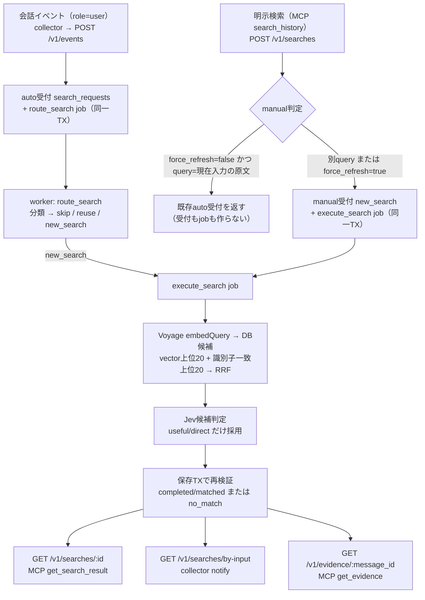
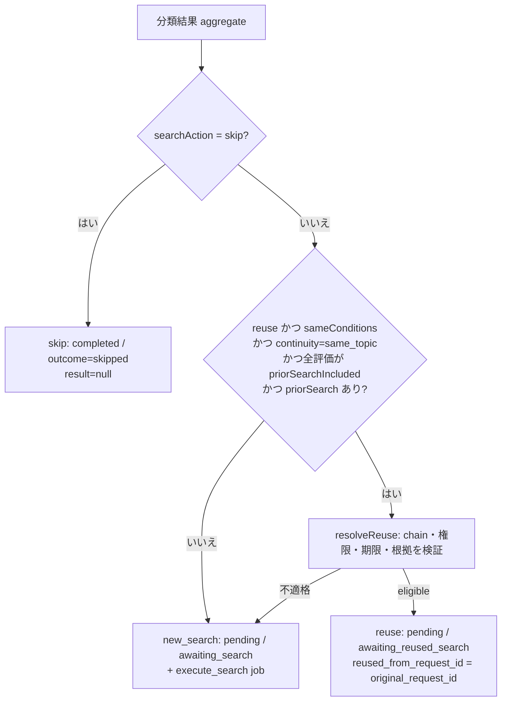
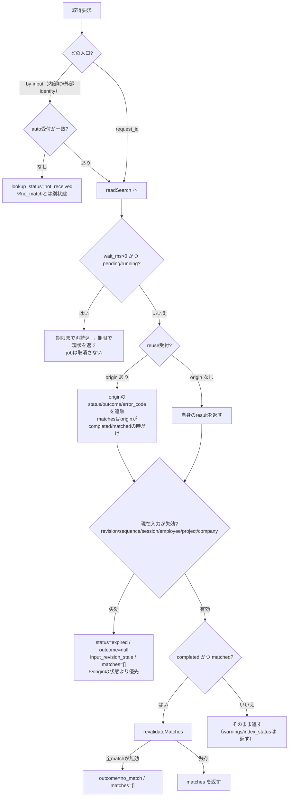

# 検索→取得フロー（条件別）

対象: `src/api/searches.ts`・`src/api/events.ts`・`src/worker/process.ts`・`src/worker/search.ts`・`src/worker/reuse.ts`・`src/mcp/central.ts` の現行実装（2026-09-25 時点）と `docs/m5-design.md`・`docs/m6-design.md`・`docs/m7-design.md`。

## 0. 全体像

要点: **検索開始は「入力イベント受領時」**（MCP呼出しへ移していない）。MCP/notifyは既に作られた受付の**取得**だけを行う。

## 1. 受付の分岐（[searches.ts:107](src/api/searches.ts#L107) / [events.ts:59](src/api/events.ts#L59)）

| 条件 | 結果 |
|---|---|
| イベント `role=user` | auto受付 + `route_search` job を同一TXで作る |
| イベント `role=assistant/agent_report` | 受付を作らない（分類・文書化だけ） |
| manual: 同じ冪等キー・同じ条件hash | 既存manual受付を返す（200・jobを増やさない） |
| manual: 同じ冪等キー・条件違い | 409 conflict |
| manual: `force_refresh=false` かつ query＝現在入力の原文 | **処理状態にかかわらず**同じinput revisionのauto受付を返す |
| manual: それ以外 | manual受付（`new_search`/`awaiting_search`）+ `execute_search` job |

補足: 質問・入力revision・案件・force_refresh・policy版の決定的hashで条件を識別するため、別条件のmanualが既存受付を上書きしない。

## 2. 振り分け `route_search` の分岐（[process.ts:582-609](src/worker/process.ts#L582-L609)）

`reuse` が不適格になる条件（[reuse.ts:43-149](src/worker/reuse.ts#L43-L149)）: policy版不一致 / 入力revisionが現行でない / 期限切れ / `matched`以外 / 根拠のcurrent revision・案件所属が不一致 / 根拠が`progress_only`・非searchable / 根拠に`revoke`・`change` / 非member / chain循環・10件超 / 直近が`new_search`でない。

## 3. 実行 `execute_search` の分岐（[search.ts:746-1030](src/worker/search.ts#L746-L1030)）

判定はこの順に効く（**失敗を`no_match`へ偽装しない**のが一貫した原則）。

| 順 | 条件 | 受付の状態 | 外部送信 |
|---|---|---|---|
| 1 | payload/scope/session不一致 | 更新しない（payloadの1件だけ失敗扱い） | なし |
| 2 | 完了済みresultあり | 変更せずjob完了（冪等） | なし |
| 3 | input revisionが既に古い | `expired/input_revision_stale` | なし |
| 4 | `active_generation_id` がNULL | `completed/no_match` | なし |
| 5 | 世代spec不一致（provider/model/次元/metric/tokenizer/前処理） | `failed/embedding_generation_mismatch` | なし |
| 6 | Voyage/Jev承認なし | job `blocked_policy` → 受付 `failed/provider_policy_unverified` | なし |
| 7 | Voyage 429/5xx/timeout | job pending(backoff) + `failed`(code) | あり |
| 8 | 候補0件 | `completed/no_match` | Voyageのみ |
| 9 | 質問だけで8,000token超過／全候補が残予算外 | `failed/input_budget_exceeded` | あり |
| 10 | Jevがuseful/directを採らない | `completed/no_match` | あり |
| 11 | 採用候補あり＋保存TX再検証OK | `completed/matched`（+M7周辺探索・`index_status`） | あり |

## 4. 取得の分岐（[searches.ts:687-812](src/api/searches.ts#L687-L812)）

再検証で何が落ちるか（[searches.ts:531-580](src/api/searches.ts#L531-L580)）:

| 対象 | 無効条件 | 影響 |
|---|---|---|
| primary evidence | current revision不一致 / 別案件 / 現在policyで`progress_only`・非searchable / `revoke`・`change` | **match全体**を落とす |
| related item（周辺・訂正・明示/推定link） | revision変更・別案件・現在入力境界違反 | そのitemだけ落とす |
| 明示session link | linkが`revoked` | そのitemだけ落とす |
| correction relation | relationが削除された | そのitemだけ落とす |

原文取得（[searches.ts:823](src/api/searches.ts#L823)）は `message_id` + `revision` 必須。同一会社・案件の保存済みrevisionを返し、旧revisionでも取得できる（不存在・別案件は404）。M7の周辺探索はここへ混ぜない。

## 5. 補助通知（notify）の分岐

受付を作らず `by-input` を叩き、1回5秒・累計10秒まで待つ。**`completed`のmatched/no_match/skipped、または`failed`だけ**を`additionalContext`へ出し、`not_received`/`pending`/`running`/timeoutは無出力。訂正・撤回を周辺根拠より優先し、省略や打切りがあれば明記する。

## 6. 秘匿値置換との関係

置換は**取り込み境界**（collectorのoutbox投入前と`POST /v1/events`の受付時）なので、候補文書・`matches.evidence.text`・`get_evidence`・notifyの追加contextに出る本文は**すべて置換済み**。一方、置換前に保存された過去revisionはそのまま検索対象になり得る（削除・backfillは未実施）。
