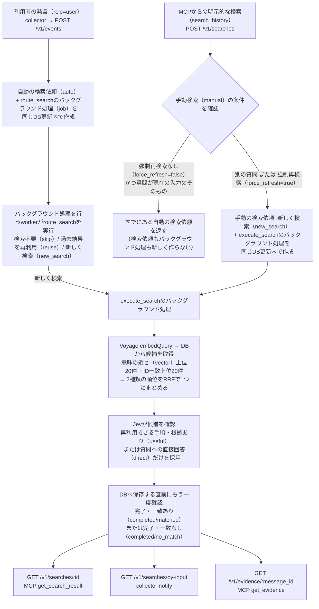
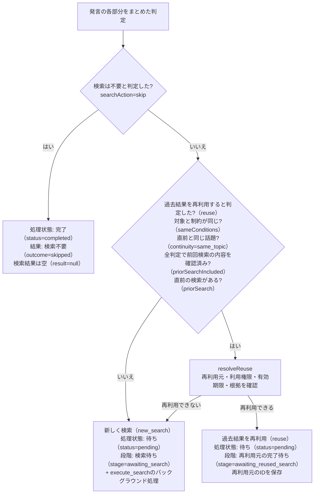
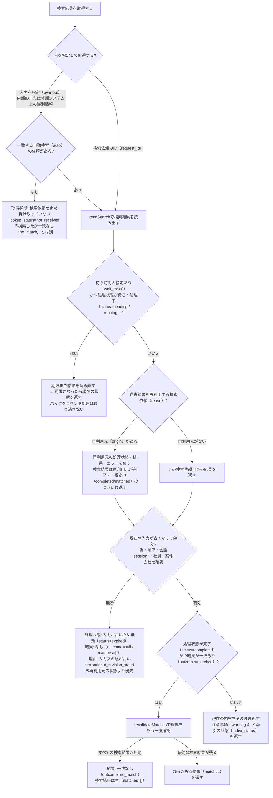

# 検索開始から結果取得までの流れ（条件ごと）

この文書がもとにしているもの: `src/api/searches.ts`・`src/api/events.ts`・`src/worker/process.ts`・`src/worker/search.ts`・`src/worker/reuse.ts`・`src/mcp/central.ts` の現在の実装（2026-09-25 時点）と `docs/m5-design.md`・`docs/m6-design.md`・`docs/m7-design.md`。

読み方: 状態や判定は日本語で説明し、実際にコードやAPIで使う値は括弧内に残す。本文と表では`code`表示にする。

## 0. 全体の流れ

```mermaid
flowchart TB
  E1["利用者の発言（role=user）<br/>collector → POST /v1/events"] --> R1["自動の検索依頼（auto）<br/>+ route_searchのバックグラウンド処理（job）を<br/>同じDB更新内で作成"]
  E2["MCPからの明示的な検索（search_history）<br/>POST /v1/searches"] --> R2{"手動検索（manual）の条件を確認"}
  R2 -->|"強制再検索なし（force_refresh=false）<br/>かつ質問が現在の入力文そのもの"| R3["すでにある自動の検索依頼を返す<br/>（検索依頼もバックグラウンド処理も新しく作らない）"]
  R2 -->|"別の質問 または 強制再検索（force_refresh=true）"| R4["手動の検索依頼: 新しく検索（new_search）<br/>+ execute_searchのバックグラウンド処理を<br/>同じDB更新内で作成"]
  R1 --> P["バックグラウンド処理を行うworkerがroute_searchを実行<br/>検索不要（skip）/ 過去結果を再利用（reuse）/ 新しく検索（new_search）"]
  P -->|新しく検索| Q["execute_searchのバックグラウンド処理"]
  R4 --> Q
  Q --> S["Voyage embedQuery → DBから候補を取得<br/>意味の近さ（vector）上位20件 + ID一致上位20件<br/>→ 2種類の順位をRRFで1つにまとめる"]
  S --> T["Jevが候補を確認<br/>再利用できる手順・根拠あり（useful）<br/>または質問への直接回答（direct）だけを採用"]
  T --> U["DBへ保存する直前にもう一度確認<br/>完了・一致あり（completed/matched）<br/>または完了・一致なし（completed/no_match）"]
  U --> G1["GET /v1/searches/:id<br/>MCP get_search_result"]
  U --> G2["GET /v1/searches/by-input<br/>collector notify"]
  U --> G3["GET /v1/evidence/:message_id<br/>MCP get_evidence"]
```

要点: **検索は入力イベントを受け取った時点で始まる**（MCPを呼んだ時点ではない）。MCPとnotifyは、すでに作られた検索依頼の**結果を受け取るだけ**。

## 1. 検索依頼を作るときの分かれ方（[searches.ts:107](src/api/searches.ts#L107) / [events.ts:59](src/api/events.ts#L59)）

| 条件 | 結果 |
|---|---|
| イベントの発言者が利用者（`role=user`） | 自動の検索依頼（`auto`）と `route_search`のバックグラウンド処理（job）を、同じ一連のDB更新の中で作る |
| イベントの発言者がアシスタント、または別の処理からの報告（`role=assistant/agent_report`） | 検索依頼は作らない（分類と文書化だけを行う） |
| 手動検索（`manual`）: 二重登録を防ぐキーが同じで、検索条件から作った識別用の値も同じ | すでにある手動の検索依頼を返す（200・バックグラウンド処理は増やさない） |
| 手動検索（`manual`）: 二重登録を防ぐキーは同じだが、検索条件が違う | 条件の競合を返す（409 conflict） |
| 手動検索（`manual`）: 強制再検索なし（`force_refresh=false`）かつ質問が現在の入力文そのもの | **処理の進み具合にかかわらず**、同じ入力文の版（input revision）の自動検索を返す |
| 手動検索（`manual`）: 上記以外 | 「新しく検索」（`new_search`）として検索待ち（`awaiting_search`）の依頼と `execute_search`のバックグラウンド処理を作る |

補足: 質問・入力文の版（input revision）・案件・強制再検索の指定（`force_refresh`）・適用するルールの版（policy version）から、同じ条件なら必ず同じになる識別用の値を作る。このため、条件が違う手動検索によって、すでにある検索依頼が上書きされることはない。

## 2. `route_search`が検索方法を決める流れ（[process.ts:582-609](src/worker/process.ts#L582-L609)）

```mermaid
flowchart TB
  A["発言の各部分をまとめた判定"] --> B{"検索は不要と判定した?<br/>searchAction=skip"}
  B -->|はい| C["処理状態: 完了（status=completed）<br/>結果: 検索不要（outcome=skipped）<br/>検索結果は空（result=null）"]
  B -->|いいえ| D{"過去結果を再利用すると判定した?（reuse）<br/>対象と制約が同じ?（sameConditions）<br/>直前と同じ話題?（continuity=same_topic）<br/>全判定で前回検索の内容を確認済み?（priorSearchIncluded）<br/>直前の検索がある?（priorSearch）"}
  D -->|いいえ| F["新しく検索（new_search）<br/>処理状態: 待ち（status=pending）<br/>段階: 検索待ち（stage=awaiting_search）<br/>+ execute_searchのバックグラウンド処理"]
  D -->|はい| E["resolveReuse<br/>再利用元・利用権限・有効期限・根拠を確認"]
  E -->|再利用できる| G["過去結果を再利用（reuse）<br/>処理状態: 待ち（status=pending）<br/>段階: 再利用元の完了待ち（stage=awaiting_reused_search）<br/>再利用元のIDを保存"]
  E -->|再利用できない| F
```

過去結果を再利用（`reuse`）できない条件（[reuse.ts:43-149](src/worker/reuse.ts#L43-L149)）: 適用するルールの版（policy version）が違う / 入力文の版（input revision）が最新ではない / 有効期限が切れている / 前回の結果が「一致あり」（`matched`）ではない / 根拠が最新版（current revision）ではない、または別の案件に属する / 根拠が進行・相槌だけ（`progress_only`）、または検索対象外 / 根拠に撤回（`revoke`）または変更（`change`）がある / 利用者が案件の利用者一覧（`member`）に登録されていない / 再利用元をたどると同じ検索依頼へ戻る、または10件を超える / 直前の検索方法が「新しく検索」（`new_search`）ではない。

## 3. `execute_search`を実行するときの分かれ方（[search.ts:746-1030](src/worker/search.ts#L746-L1030)）

条件は上から順に確認する。**エラーを「一致する結果なし」（`no_match`）として扱わない**ことが、すべての条件に共通する決まり。

| 順番 | 条件 | 検索依頼の状態 | 外部サービスへの送信 |
|---|---|---|---|
| 1 | バックグラウンド処理が指定する検索依頼・会社・案件・会話（session）のいずれかが実際の対象と違う | 検索依頼の状態は変えず、指定された1件のバックグラウンド処理だけを失敗として扱う | なし |
| 2 | すでに完了した検索結果がある | 何も変えず、バックグラウンド処理を完了する（二重実行しても結果は変わらない） | なし |
| 3 | 検索を始めた後に入力文が更新され、対象の版（input revision）が古くなった | 入力が古いため無効（status: `expired`、error: `input_revision_stale`） | なし |
| 4 | 検索に使える有効な索引がない（`active_generation_id`がNULL） | 完了・一致なし（status: `completed`、outcome: `no_match`） | なし |
| 5 | 索引を作った設定と現在の設定が違う（提供元・埋め込みに使うmodel・次元数・距離の測り方・文字の分け方・前処理） | 失敗・索引設定の不一致（status: `failed`、error: `embedding_generation_mismatch`） | なし |
| 6 | VoyageまたはJevへデータを送る承認がない | バックグラウンド処理は承認待ちで停止（`blocked_policy`）、検索依頼は承認未確認による失敗（`failed/provider_policy_unverified`） | なし |
| 7 | Voyageがアクセス過多（429）・サーバー障害（5xx）・時間切れ（`timeout`）を返す | バックグラウンド処理は再実行待ち（`pending`）へ戻して待ち時間を延ばす。検索依頼はエラー内容付きの失敗（`failed`）にする | あり |
| 8 | DB検索で候補が1件も見つからない | 完了・一致なし（`completed/no_match`） | Voyageのみ |
| 9 | 質問だけで文字量の上限（8,000 token）を超える、または候補を1件も上限内に収められない | 失敗・入力上限超過（`failed/input_budget_exceeded`） | あり |
| 10 | Jevが「再利用できる手順・根拠あり」（`useful`）または「質問への直接回答」（`direct`）と判定した候補が1件もない | 完了・一致なし（`completed/no_match`） | あり |
| 11 | 採用した候補があり、保存直前の確認にも通る | 完了・一致あり（`completed/matched`）。M7の周辺探索結果と索引の状態（`index_status`）も含む | あり |

## 4. 検索結果を受け取るときの分かれ方（[searches.ts:687-812](src/api/searches.ts#L687-L812)）

```mermaid
flowchart TB
  S["検索結果を取得する"] --> T{"何を指定して取得する?"}
  T -->|"入力を指定（by-input）<br/>内部IDまたは外部システム上の識別情報"| U{"一致する自動検索（auto）の依頼がある?"}
  U -->|なし| NR["取得状態: 検索依頼をまだ受け取っていない<br/>lookup_status=not_received<br/>※検索したが一致なし（no_match）とは別"]
  U -->|あり| V["readSearchで検索結果を読み出す"]
  T -->|"検索依頼のID（request_id）"| V
  V --> W{"待ち時間の指定あり（wait_ms>0）<br/>かつ処理状態が待ち・処理中<br/>（status=pending / running）?"}
  W -->|はい| X["期限まで結果を読み直す → 期限になったら現在の状態を返す<br/>バックグラウンド処理は取り消さない"]
  W -->|いいえ| Y{"過去結果を再利用する検索依頼（reuse）?"}
  Y -->|"再利用元（origin）がある"| Z["再利用元の処理状態・結果・エラーを使う<br/>検索結果は再利用元が完了・一致あり<br/>（completed/matched）のときだけ返す"]
  Y -->|"再利用元がない"| AA["この検索依頼自身の結果を返す"]
  Z --> AB{"現在の入力が古くなって無効?<br/>版・順序・会話（session）・社員・案件・会社を確認"}
  AA --> AB
  AB -->|無効| AC["処理状態: 入力が古いため無効（status=expired）<br/>結果: なし（outcome=null / matches=[]）<br/>理由: 入力文の版が古い（error=input_revision_stale）<br/>※再利用元の状態より優先"]
  AB -->|有効| AD{"処理状態が完了（status=completed）<br/>かつ結果が一致あり（outcome=matched）?"}
  AD -->|はい| AE["revalidateMatchesで根拠をもう一度確認"]
  AD -->|いいえ| AF["現在の内容をそのまま返す<br/>注意事項（warnings）と索引の状態（index_status）も返す"]
  AE -->|"すべての検索結果が無効"| AG["結果: 一致なし（outcome=no_match）<br/>検索結果は空（matches=[]）"]
  AE -->|"有効な検索結果が残る"| AH["残った検索結果（matches）を返す"]
```

`revalidateMatches`が検索結果を返す直前にもう一度確認し、無効なら外すもの（[searches.ts:531-580](src/api/searches.ts#L531-L580)）:

| 対象 | 無効になる条件 | 結果への影響 |
|---|---|---|
| 検索結果の中心となる根拠（primary evidence） | 保存時から版が変わった / 別の案件に属する / 現在のルールでは進行・相槌だけ（`progress_only`）または検索対象外 / 撤回（`revoke`）または変更（`change`）がある | **検索結果全体**を外す |
| 中心となる根拠に付けた関連情報（related item: 前後の発言・訂正・明示または推定されたつながり） | 保存時から版が変わった / 別の案件に属する / 現在の入力に含めてよい範囲を外れる | その関連情報だけを外す |
| 会話間の明示されたつながり（session link） | つながりが撤回済み（`revoked`） | その関連情報だけを外す |
| 訂正元と訂正先の関係（correction relation） | 関係が削除されている | その関連情報だけを外す |

もとの文章を取得する処理（[searches.ts:823](src/api/searches.ts#L823)）では、発言のID（`message_id`）と版（`revision`）が必要。同じ会社・案件に保存されている版を返す。古い版も取得できるが、存在しない場合や別の案件に属する場合は404を返す。M7で行う前後の発言などの追加検索は、この処理には含めない。

## 5. 補助通知（notify）の処理

新しい検索依頼は作らず、入力を指定する方法（`by-input`）で結果を取得する。同期の`notify`は今回の入力だけを最大5秒待ち、間に合わなければ非同期の`notify-late`が最大60秒まで待って次の安全地点で渡す。**完了（`completed`）した「一致あり」（`matched`）・「一致なし」（`no_match`）・「検索不要」（`skipped`）、または失敗（`failed`）だけ**を追加情報欄（`additionalContext`）へ出す。「検索依頼をまだ受け取っていない」（`not_received`）・「処理待ち」（`pending`）・「処理中」（`running`）・「時間切れ」（`timeout`）の場合は何も出さない。訂正と撤回は前後の発言などの関連情報より先に示し、情報を省いた場合や途中で打ち切った場合は、そのことを明記する。

## 6. 秘密にする値の置き換え

値の置き換えは、**データを受け取る時点**（collectorが送信待ち箱（`outbox`）へ入れる前と、`POST /v1/events`が受け付けた時）で行う。そのため、候補文書・`matches.evidence.text`・`get_evidence`・通知処理（notify）の追加情報欄（`additionalContext`）に出る本文は、**すべて置き換え済み**。ただし、置き換え機能を入れる前に保存した古い版（`revision`）は、そのまま検索対象になる場合がある（古いデータの削除と、過去にさかのぼった置き換えはまだ行っていない）。
