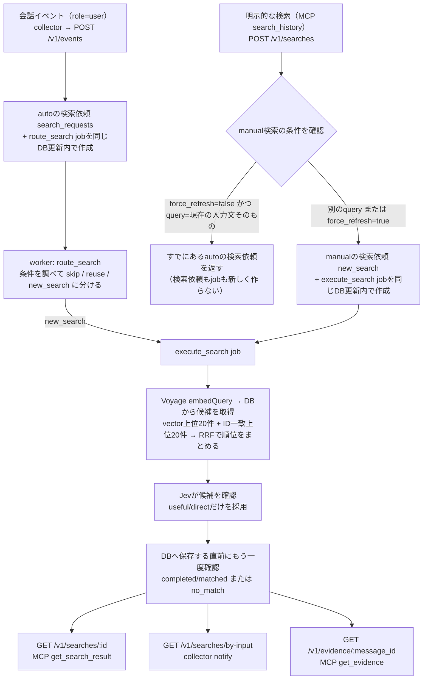
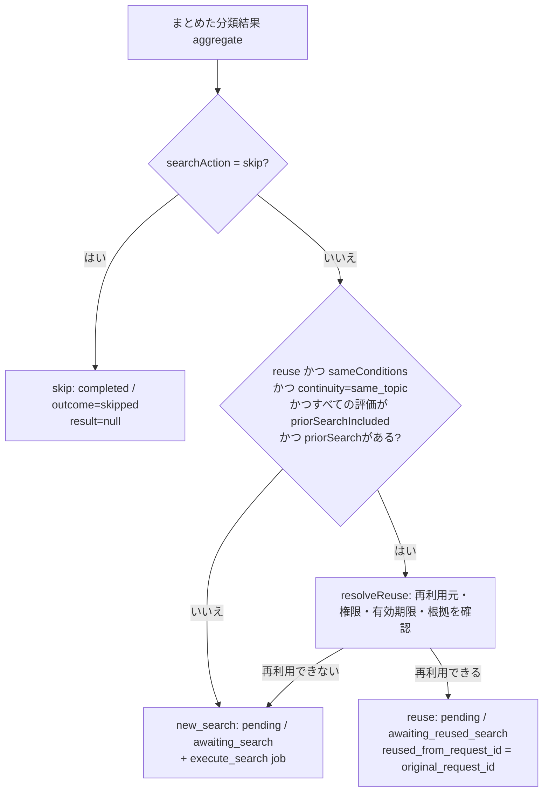
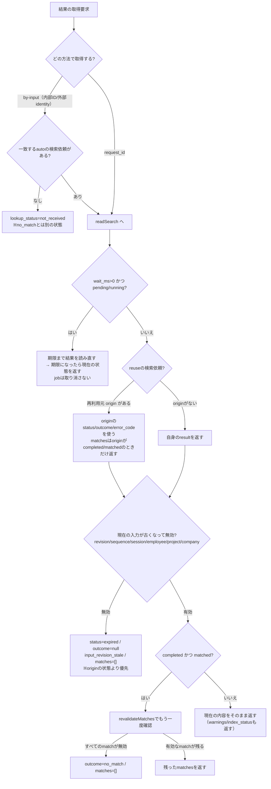

# 検索開始から結果取得までの流れ（条件ごと）

この文書がもとにしているもの: `src/api/searches.ts`・`src/api/events.ts`・`src/worker/process.ts`・`src/worker/search.ts`・`src/worker/reuse.ts`・`src/mcp/central.ts` の現在の実装（2026-09-25 時点）と `docs/m5-design.md`・`docs/m6-design.md`・`docs/m7-design.md`。

## 0. 全体の流れ

```mermaid
flowchart TB
  E1["会話イベント（role=user）<br/>collector → POST /v1/events"] --> R1["autoの検索依頼 search_requests<br/>+ route_search jobを同じDB更新内で作成"]
  E2["明示的な検索（MCP search_history）<br/>POST /v1/searches"] --> R2{"manual検索の条件を確認"}
  R2 -->|"force_refresh=false かつ query=現在の入力文そのもの"| R3["すでにあるautoの検索依頼を返す<br/>（検索依頼もjobも新しく作らない）"]
  R2 -->|"別のquery または force_refresh=true"| R4["manualの検索依頼 new_search<br/>+ execute_search jobを同じDB更新内で作成"]
  R1 --> P["worker: route_search<br/>条件を調べて skip / reuse / new_search に分ける"]
  P -->|new_search| Q["execute_search job"]
  R4 --> Q
  Q --> S["Voyage embedQuery → DBから候補を取得<br/>vector上位20件 + ID一致上位20件 → RRFで順位をまとめる"]
  S --> T["Jevが候補を確認<br/>useful/directだけを採用"]
  T --> U["DBへ保存する直前にもう一度確認<br/>completed/matched または no_match"]
  U --> G1["GET /v1/searches/:id<br/>MCP get_search_result"]
  U --> G2["GET /v1/searches/by-input<br/>collector notify"]
  U --> G3["GET /v1/evidence/:message_id<br/>MCP get_evidence"]
```

要点: **検索は入力イベントを受け取った時点で始まる**（MCPを呼んだ時点ではない）。MCPとnotifyは、すでに作られた検索依頼の**結果を受け取るだけ**。

## 1. 検索依頼を作るときの分かれ方（[searches.ts:107](src/api/searches.ts#L107) / [events.ts:59](src/api/events.ts#L59)）

| 条件 | 結果 |
|---|---|
| イベントが `role=user` | autoの検索依頼と `route_search` jobを、同じ一連のDB更新の中で作る |
| イベントが `role=assistant/agent_report` | 検索依頼は作らない（分類と文書化だけを行う） |
| manual: 二重登録を防ぐキーが同じで、検索条件から作った識別用の値も同じ | すでにあるmanualの検索依頼を返す（200・jobは増やさない） |
| manual: 二重登録を防ぐキーは同じだが、検索条件が違う | 409 conflict |
| manual: `force_refresh=false` かつ query＝現在の入力文そのもの | **処理の進み具合にかかわらず**、同じinput revisionのautoの検索依頼を返す |
| manual: 上記以外 | manualの検索依頼（`new_search`/`awaiting_search`）と `execute_search` jobを作る |

補足: 質問・input revision・案件・`force_refresh`・policy版から、同じ条件なら必ず同じになる識別用の値を作る。このため、条件が違うmanual検索によって、すでにある検索依頼が上書きされることはない。

## 2. `route_search`で処理を分ける流れ（[process.ts:582-609](src/worker/process.ts#L582-L609)）

```mermaid
flowchart TB
  A["まとめた分類結果 aggregate"] --> B{"searchAction = skip?"}
  B -->|はい| C["skip: completed / outcome=skipped<br/>result=null"]
  B -->|いいえ| D{"reuse かつ sameConditions<br/>かつ continuity=same_topic<br/>かつすべての評価が priorSearchIncluded<br/>かつ priorSearchがある?"}
  D -->|いいえ| F["new_search: pending / awaiting_search<br/>+ execute_search job"]
  D -->|はい| E["resolveReuse: 再利用元・権限・有効期限・根拠を確認"]
  E -->|再利用できる| G["reuse: pending / awaiting_reused_search<br/>reused_from_request_id = original_request_id"]
  E -->|再利用できない| F
```

`reuse`できない条件（[reuse.ts:43-149](src/worker/reuse.ts#L43-L149)）: policy版が違う / input revisionが最新ではない / 有効期限が切れている / 結果が`matched`ではない / 根拠のcurrent revisionまたは案件が一致しない / 根拠が`progress_only`または検索対象外 / 根拠に`revoke`または`change`がある / 利用者がmemberではない / 再利用元をたどると同じ検索依頼へ戻る、または10件を超える / 直前の検索方法が`new_search`ではない。

## 3. `execute_search`を実行するときの分かれ方（[search.ts:746-1030](src/worker/search.ts#L746-L1030)）

条件は上から順に確認する。**エラーを`no_match`として扱わない**ことが、すべての条件に共通する決まり。

| 順番 | 条件 | 検索依頼の状態 | 外部サービスへの送信 |
|---|---|---|---|
| 1 | payload・scope・sessionが一致しない | 状態を変えない（payloadで指定された1件だけを失敗として扱う） | なし |
| 2 | すでに完了したresultがある | 何も変えず、jobを完了する（二重実行しても結果は変わらない） | なし |
| 3 | input revisionがすでに古い | `expired/input_revision_stale` | なし |
| 4 | `active_generation_id` がNULL | `completed/no_match` | なし |
| 5 | 埋め込み世代の設定が一致しない（provider/model/次元/metric/tokenizer/前処理） | `failed/embedding_generation_mismatch` | なし |
| 6 | VoyageまたはJevの利用が承認されていない | jobは`blocked_policy`、検索依頼は`failed/provider_policy_unverified` | なし |
| 7 | Voyageが429・5xx・timeoutを返す | jobはpendingに戻して待ち時間を延ばし、検索依頼はエラーcode付きの`failed`にする | あり |
| 8 | 候補が0件 | `completed/no_match` | Voyageのみ |
| 9 | 質問だけで8,000 tokenを超える、または全候補が残っているtoken数に収まらない | `failed/input_budget_exceeded` | あり |
| 10 | Jevがuseful/directの候補を1件も選ばない | `completed/no_match` | あり |
| 11 | 採用した候補があり、保存直前の確認にも通る | `completed/matched`（M7の周辺探索と`index_status`も含む） | あり |

## 4. 検索結果を受け取るときの分かれ方（[searches.ts:687-812](src/api/searches.ts#L687-L812)）

```mermaid
flowchart TB
  S["結果の取得要求"] --> T{"どの方法で取得する?"}
  T -->|"by-input（内部ID/外部identity）"| U{"一致するautoの検索依頼がある?"}
  U -->|なし| NR["lookup_status=not_received<br/>※no_matchとは別の状態"]
  U -->|あり| V["readSearch へ"]
  T -->|"request_id"| V
  V --> W{"wait_ms>0 かつ pending/running?"}
  W -->|はい| X["期限まで結果を読み直す → 期限になったら現在の状態を返す<br/>jobは取り消さない"]
  W -->|いいえ| Y{"reuseの検索依頼?"}
  Y -->|"再利用元 origin がある"| Z["originのstatus/outcome/error_codeを使う<br/>matchesはoriginがcompleted/matchedのときだけ返す"]
  Y -->|"originがない"| AA["自身のresultを返す"]
  Z --> AB{"現在の入力が古くなって無効?<br/>revision/sequence/session/employee/project/company"}
  AA --> AB
  AB -->|無効| AC["status=expired / outcome=null<br/>input_revision_stale / matches=[]<br/>※originの状態より優先"]
  AB -->|有効| AD{"completed かつ matched?"}
  AD -->|はい| AE["revalidateMatchesでもう一度確認"]
  AD -->|いいえ| AF["現在の内容をそのまま返す<br/>（warnings/index_statusも返す）"]
  AE -->|"すべてのmatchが無効"| AG["outcome=no_match / matches=[]"]
  AE -->|"有効なmatchが残る"| AH["残ったmatchesを返す"]
```

`revalidateMatches`で検索結果から外すもの（[searches.ts:531-580](src/api/searches.ts#L531-L580)）:

| 対象 | 無効になる条件 | 結果への影響 |
|---|---|---|
| 中心となる根拠（primary evidence） | current revisionが違う / 別の案件に属する / 現在のpolicyでは`progress_only`または検索対象外 / `revoke`または`change`がある | **match全体**を外す |
| 関連項目（related item: 周辺情報・訂正・明示または推定されたlink） | revisionが変わった / 別の案件に属する / 現在の入力に含めてよい範囲を外れる | そのitemだけを外す |
| 明示されたsession link | linkが`revoked` | そのitemだけを外す |
| 訂正を表すrelation | relationが削除されている | そのitemだけを外す |

もとの文章を取得する処理（[searches.ts:823](src/api/searches.ts#L823)）では、`message_id`と`revision`が必要。同じ会社・案件に保存されているrevisionを返す。古いrevisionも取得できるが、存在しない場合や別の案件に属する場合は404を返す。M7の周辺探索はこの処理には含めない。

## 5. 補助通知（notify）の処理

新しい検索依頼は作らず、`by-input`で結果を取得する。1回につき5秒、合計10秒まで待つ。**`completed`になったmatched・no_match・skipped、または`failed`だけ**を`additionalContext`へ出す。`not_received`・`pending`・`running`・timeoutの場合は何も出さない。訂正と撤回は周辺の根拠より先に示し、情報を省いた場合や途中で打ち切った場合は、そのことを明記する。

## 6. 秘密にする値の置き換え

値の置き換えは、**データを受け取る時点**（collectorがoutboxへ入れる前と、`POST /v1/events`が受け付けた時）で行う。そのため、候補文書・`matches.evidence.text`・`get_evidence`・notifyの`additionalContext`に出る本文は、**すべて置き換え済み**。ただし、置き換え機能を入れる前に保存した古いrevisionは、そのまま検索対象になる場合がある（古いデータの削除と、過去にさかのぼった置き換えはまだ行っていない）。
